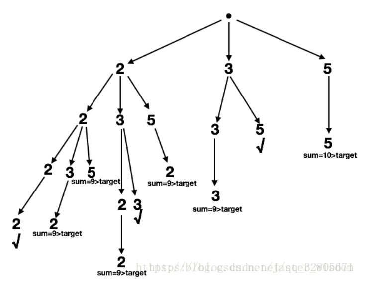

### 数组题

---

> https://leetcode-cn.com/tag/array/


#### 1. 两数之和  #1 

- https://leetcode-cn.com/problems/two-sum/
- 给定一个整数数组 `nums` 和一个目标值 `target`，请你在该数组中找出和为目标值的那 **两个** 整数，并返回他们的数组下标。你可以假设每种输入只会对应一个答案。但是，你不能重复利用这个数组中同样的元素。

- ```java
  给定 nums = [2, 7, 11, 15], target = 9
  因为 nums[0] + nums[1] = 2 + 7 = 9
  所以返回 [0, 1]
  ```

- 思路1：暴力法，直接两重循环直接遍历，O(n^2^)；

  ```c++
  vector<int> twoSum(vector<int>& nums, int target) {
          vector<int> res;
          for(int i = 0; i < nums.size(); i++){
              for(int j = i+1; j < nums.size(); j++){
                  if(nums[i] + nums[j] == target){
                      res.push_back(i);
                      res.push_back(j);
                      return res;
                  }
              }
          }
      }
  ```

- 思路2：哈希表法。就是利用哈希的“近似”常量时间查找的优点，按序遍历数组，对于值n，判断target-n的值是否在数组中，O(n)。

  ```c++ 
  class Solution {
  public:
      vector<int> twoSum(vector<int>& nums, int target) {
          map<int,int> m;
          map<int,int>::iterator itr;
          vector<int> ans;
          for(int i=0; i<nums.size(); i++)
          {
              if(i == 0)
              {	//插入的key是数的值，value是index
                  m.insert(pair<int,int>(nums.at(i),i));
                  continue;
              }
              itr = m.find(target-nums.at(i));
              if(itr != m.end())
              {
                  ans.push_back(itr->second);
                  ans.push_back(i);
                  return ans;
              }
              m.insert(pair<int,int>(nums.at(i),i));
          }
      }
  };
  ```

  另外的Java实现：

  ```java
  public int[] twoSum(int[] nums, int target) {
      Map<Integer, Integer> map = new HashMap<>();
      for (int i = 0; i < nums.length; i++) {
          int complement = target - nums[i];
          if (map.containsKey(complement)) {
              return new int[] { map.get(complement), i };
          }
          map.put(nums[i], i);
      }
      throw new IllegalArgumentException("No two sum solution");
  }
  ```


&nbsp;

#### 2. 数组去重 #26

- https://leetcode-cn.com/problems/remove-duplicates-from-sorted-array/

- 给定一个**排序**数组，你需要在**原地**删除重复出现的元素，使得每个元素只出现一次，返回移除后数组的新长度。不要使用额外的数组空间，你必须在**原地修改输入数组**并在使用 O(1) 额外空间的条件下完成

- ```
  给定数组 nums = [1,1,2], 
  函数应该返回新的长度 2, 并且原数组 nums 的前两个元素被修改为 1, 2。 
  你不需要考虑数组中超出新长度后面的元素
  ```

- 思路1：暴力法，外层循环i每次加1，然后用一个指针j每次往后找，找到第一个不等于cur的值，置为i的值；并更新cur。数组有序，所以j应该只遍历一次。O(n)

  ```c++
  int removeDuplicates(vector<int>& nums) {
      if(nums.empty())
          return 0;
      int cur = nums[0];
      int j = 1, len = 1;
      for(int i = 1; i < nums.size(); i++){
          while(j < nums.size() && nums[j] == cur)
              j++;
          if(j < nums.size()){
              nums[i] = nums[j];
              cur = nums[i];
              len++;
          }
          else break;
      }
      return len;
  }
  //或者写的更简单点
  int removeDuplicates(vector<int>& nums) {
          if (nums.empty()) 
              return 0;       
          int cur = 0;
          for (int i = 1; i < nums.size(); i++) {
              if (nums[cur] != nums[i]) {  //将变量i放在右边，时间短4ms?
                  cur++;
                  nums[cur] = nums[i];
              }
          }
          return cur + 1;
      }
  ```

  &nbsp;


#### 3. 移除元素 #27

- https://leetcode-cn.com/problems/remove-element/

- 给定一个数组 *nums* 和一个值 *val*，你需要**原地**移除所有数值等于 *val* 的元素，返回移除后数组的新长度。

  不要使用额外的数组空间，你必须在**原地修改输入数组**并在使用 O(1) 额外空间的条件下完成。

  元素的顺序可以改变。你不需要考虑数组中超出新长度后面的元素。

- ```
  给定 nums = [0,1,2,2,3,0,4,2], val = 2,
  函数应该返回新的长度 5, 并且 nums 中的前五个元素为 0, 1, 3, 0, 4。
  注意这五个元素可为任意顺序。
  你不需要考虑数组中超出新长度后面的元素。
  ```

- 思路1：暴力法，排序，然后删除目标值，再移动后面的元素；O(n)

  ```c++
  int removeElement(vector<int>& nums, int val) {
          sort(nums.begin(), nums.end());
          vector<int>::iterator it;
          int index = 0;
          for(it = nums.begin(); it != nums.end(); it++){
             if(*it != val){               
                 index++;
             }
              else break;            
          }        
          int flag = 1;
          for(int i = index ; i < nums.size(); i++){
              if(flag && nums[index] == nums[i]){                
                  continue;
              }
              flag = 0;
              nums[index++] = nums[i];
          }
          return index;
      }
  ```

- 思路2：双指针，直接遍历，如果第i个值不等于目标值，则直接将该值赋值到第i个位置。原因：第i个位置上的值肯定已经被遍历过。

  ```c++
  int removeElement(vector<int>& nums, int val) {
          int j = 0;
          for( int i = 0 ; i < nums.size() ; i ++ ){
              if( nums[i] != val )
                  nums[j++] = nums[i]; 
          }
          return j;
      }
  ```

- 思路3：考虑删除的元素很少时，如只有第一个或者末尾一个，则不需要过多的移动元素。交换两个元素的位置，数组大小减一即可。

  ```c++
  int removeElement(vector<int>& nums, int val) {
          int i = 0， n = nums.size();
          while (i < n) {
              if (nums[i] == val) {
                  nums[i] = nums[n - 1];                
                  n--; // reduce array size by one
              } else {
                  i++;
              }
          }
          return n;
      }
  ```

&nbsp;


#### 4. 搜索插入位置 #35

- https://leetcode-cn.com/problems/search-insert-position/
- 给定一个排序数组和一个目标值，在数组中找到目标值，并返回其索引。如果目标值不存在于数组中，返回它将会被按顺序插入的位置。假设数组没有重复元素。

- ```c++
  输入: [1,3,5,6], 5
  输出: 2
  输入: [1,3,5,6], 7
  输出: 4
  ```

- 思路1：暴力法直接便利，找到插入位置；**技巧**：可以将要插入的值放在数组的末尾，如果找到的位置不是数组长度（代表插入的末尾），则直接插入即可。

  ```c++
  int searchInsert(vector<int>& nums, int target) {
          int res = nums.size();
          for(int i = 0; i < nums.size(); i++){
              if(nums[i] < target)   continue;
              else{
                  res = i;     break;
              }
          }
          return res;
      }
  ```

- 思路2：二分查找，找到目标值的下边界

  ```c++
  int searchInsert(vector<int>& nums, int target) {
      int left=0;
      int right=nums.size() - 1;
      while(left<=right){
          int mid = (left+right)/2;
          if(nums[mid]<target)
              left=mid+1;
          else
              right=mid-1;
      }
      return left;
  }
  ```


&nbsp;

#### 5. 最大子序列和 #53

- https://leetcode-cn.com/problems/maximum-subarray/

- 给定一个整数数组 `nums` ，找到一个具有最大和的连续子数组（子数组最少包含一个元素），返回其最大和。

- 思路1：暴力法，两层循环找N方个区间，不同的区间进行累加，找到max那个区间。O(N^3^)

  ```java
  private int max = Integer.MIN_VALUE;
  public int maxSubArray(int[] nums) {
      int sum;
      for (int i = 0; i < nums.length; i++) {// 子序列左端点
          for (int j = i; j < nums.length; j++) {// 子序列右端点
              sum = 0;
              for (int k = i; k <= j; k++) {//暴力计算
                  sum += nums[k];
              }
              if (sum > max) {
                  max = sum;
              }
          }
      }
      return max;
  }
  ```

- 思路2：改进的暴力法，也就是说当外层循环控制的左边界不动，右边界每次加1的计算区间，可以直接累加，不用做区间的所有遍历。O(N^2^)

  ```java
  private int max = Integer.MIN_VALUE;
  public int maxSubArray(int[] nums) {
      int sum;
      for (int i = 0; i < nums.length; i++) {// 子序列左端点
          sum = 0;
          for (int j = i; j < nums.length; j++) {// 子序列右端点
              sum += nums[j];// 这里就相当于每次根据前一次的序列来计算新的序列
              if (sum > max)
                  max = sum;
          }
      }
      return max;
  }
  ----c++----
  int maxSubArray(vector<int>& nums) {
      int max = INT_MIN;
      for(int i =0;i<nums.size();i++){
          int res=0;
          for(int j = i;j<nums.size();j++){
              res += nums[j];
              if(res > max){
                  max = res;
              }
          }
      }
      return max;
  }
  ```

- 思路3：扫描法？当我们加上一个正数时，和会增加；当我们加上一个负数时，和会减少。如果当前得到的和是个负数，那么这个和在接下来的累加中应该抛弃并重新清零，不然的话这个负数将会减少接下来的和。也就说，遇到一个数，先看当前累积结果；为负则清零，重新开始；正则继续遍历。O(N)，证明方法略？

  ```c++
  int maxSubArray(vector<int>& nums) {
      int max = nums[0];   //全为负数则返回最大的
      int cur = nums[0];
      for(int i =1;i<nums.size();i++){
          if(cur < 0){
              cur = nums[i];
          }
          else cur += nums[i];//如果当前累积不小于0，那么他会对接下来的和有积极影响
          if(cur > max) max = cur;
      }
      return max;
  }
  ```

- 思路4：动态规划，和O(N)的最长增长子序列类似。用一个数组sum(i)表示，以i元素为结尾的子序列的最大的和。我觉得其实和思路3 的实现类似，都是累积为负就抛弃，为正则继续累积。

  ```c++
  int maxSubArray(vector<int>& nums) {
      int max = nums[0];
      int dp = nums[0];
      for(int i =1;i<nums.size();i++){
          dp = std::max(dp + nums[i], nums[i]);
          if(dp > max) max = dp; // max = std::max(max, dp);
      }
      return max;
  }
  ```

- 思路5：分治法


&nbsp;

#### 6. 加1 # 66

- https://leetcode-cn.com/problems/plus-one/

- 给定一个由**整数**组成的**非空**数组所表示的非负整数，在该数的基础上加一。最高位数字存放在数组的首位，数组中每个元素只存储一个数字。你可以假设除了整数 0 之外，这个整数不会以零开头。

- 思路1：暴力法，分两种情况：最高位不进位和最高位进位；进位则数组长度加1

  ```c++
  vector<int> plusOne(vector<int>& digits) {
      int carry = 1;
      int len = digits.size();
      for(int i =len - 1;i>=0;i--){           
          if(carry == 0){  //没有进位
              return digits;
          }
          int temp = digits[i] + carry;
          carry = temp / 10;
          digits[i] = temp % 10;
      }
      if(carry != 0){
          digits.insert(digits.begin(),1);            
      }
      return digits;
  }
  ```

&nbsp;

#### 7.  合并两个有序数组 #88

- https://leetcode-cn.com/problems/merge-sorted-array/

- 给定两个有序整数数组 *nums1* 和 *nums2*，将 *nums2* 合并到 *nums1* 中*，*使得 *num1* 成为一个有序数组。

- 思路1：申请额外的数组空间，分别比较放入后，再将该数组赋值给nums1

  ``` c++
  void merge(vector<int>& nums1, int m, vector<int>& nums2, int n) {
          int i = 0, j =0;
          int c[m+n];
          int k=0;
          while(i < m && j < n){
              if(nums2[j] < nums1[i]){
                  c[k++]=nums2[j];
                  j++;
              }
              else{
                  c[k++]=nums1[i];
                  i++;
              }
          }
          if(i>=m && j<n){
              while(j<n){
                  c[k++] = nums2[j++];
              }
          }
          else if(j>=n && i<m){
              while(i<m){
                  c[k++] = nums1[i++];
              }
          }
          for(int p = 0; p < k; p++){
             // cout<<" "<<c[p];
              nums1[p] = c[p];
          }
      }
  ```

- 思路2：从nums1的末尾往前插入值；由于合并后A数组的大小必定是m+n，所以从最后面开始往前赋值，先比较A和B中最后一个元素的大小，把较大的那个插入到m+n-1的位置上，再依次向前推。如果A中所有的元素都比B小，那么前m个还是A原来的内容，没有改变。如果A中的数组比B大的，当A循环完了，B中还有元素没加入A，直接用个循环把B中所有的元素覆盖到A剩下的位置

  ```c++
  void merge(vector<int>& nums1, int m, vector<int>& nums2, int n) {
          int size = m + n - 1;
          while(m > 0 && n > 0){
              //cout<<"***";
              if(nums1[m - 1] > nums2[n - 1]){
                  nums1[size--] = nums1[m - 1];
                  m--;
              }
              else{
                  nums1[size--] = nums2[n - 1];
                  n--;
              }
          }
          if(m == 0 && n > 0){
              cout<<"---"<<endl;
              while(n){
                 // cout<<n<<" "<<nums2[n - 1]<<endl;
                  nums1[size--] = nums2[n - 1];
                  n--;
              }
          }
          
      }
  --------
  void merge(int A[], int m, int B[], int n) {
      int count = m + n - 1;
      --m; --n;
      while (m >= 0 && n >= 0)
          A[count--] = A[m] > B[n] ? A[m--] : B[n--];
      while (n >= 0)
          A[count--] = B[n--];
  }
  ```

  &nbsp;

#### 8.  杨辉三角2 #119

- https://leetcode-cn.com/problems/pascals-triangle-ii/submissions/

- ``` c++
  vector<int> getRow(int rowIndex) {
      vector<int> res;
      res.push_back(1);
      vector<int> col;
      for(int i=1;i<=rowIndex;i++){
          col.push_back(1);
          for(int j = 1; j < i; j++){
              col.push_back(res[j-1] + res[j]);
          }
          col.push_back(1);
          res = col;
          col.clear();
      }
      return res;
  }
  --------或者二项式定理-------
  vector<int> getRow(int rowIndex) {
          vector<int> res(rowIndex + 1, 1);
          long  num=1;
          int j=1;
          for(int i = 1; i < rowIndex; i++){
              num *= rowIndex - i + 1;
              num /= j++;
              res[i]=num;
          }
          return res;
      }
  ```

&nbsp;

#### 9. 买股票 # 121

- https://leetcode-cn.com/problems/best-time-to-buy-and-sell-stock/submissions/

- 思路1：暴力

- 思路2：一次遍历，找到峰值和谷值；前一个的最小值得到的最大收益，与遍历到的当前值的大小相比；其实相当于一维的DP

  ```c++
  int maxProfit(vector<int>& prices) {
      int len = prices.size();
      if(len <= 0)
          return 0;
      int mx = 0;
      int mn = prices[0];
      for(int i=1; i < len; i++){
         mn = std::min(mn, prices[i]);
         if(prices[i] - mn > mx){
             mx = prices[i] - mn;
         }
      }
      return mx;
  }
  ```

&nbsp;

#### 10. 买股票2  #122

- https://leetcode-cn.com/problems/best-time-to-buy-and-sell-stock-ii/

- 多次买卖股票

- 思路1：峰谷法

  ```c++
  int maxProfit(vector<int>& prices) {
          int i = 0;
          int low = prices[0];
          int high = prices[0];
          int maxx = 0;
          while(i < prices.size() - 1){
              while(i < prices.size() - 1 && prices[i] >= prices[i+1])
                  i++; //找到一个谷底
              low = prices[i];
              while(i < prices.size() - 1 && prices[i] <= prices[i+1])
                  i++;
              high = prices[i];
              maxx += high - low;
          }
          return maxx;
      }
  ```

- 思路2：一次遍历

  ```c++
  int maxProfit(vector<int>& prices) {
          if(prices.size()<=0){
              return 0;
          }        
          int maxx = 0;
          for(int i = 1; i < prices.size(); i++){
              if(prices[i]>prices[i-1])
                  maxx += prices[i] - prices[i-1];
          }
          return maxx;
      }
  ```

&nbsp;

#### 11. 两数之和2 #167

- https://leetcode-cn.com/problems/two-sum-ii-input-array-is-sorted/submissions/

- 返回下标数组pair

- 思路：双指针

  ```c++
  vector<int> twoSum(vector<int>& numbers, int target) {
      int l=0,r=numbers.size()-1;
      while (l<r){
          if (numbers[l]+numbers[r]==target){
              int ret[]={l+1,r+1};
              return vector<int>(ret,ret+2);
          } else if(numbers[l]+numbers[r]<target)
              l++;
          else
              r--;
      }
      return vector<int>();
  }
  ```

&nbsp;

#### 12. 求众数 #169

- https://leetcode-cn.com/problems/majority-element/comments/

- 哈希法：

  ```c++
  int majorityElement(vector<int>& nums) {
          int size = nums.size() / 2;
          map<int,int> mp;
          for(int i = 0; i < nums.size(); i++){
              mp[nums[i]]++;
          }
          int res = 0;
          for (std::map<int,int>::iterator it=mp.begin(); it!=mp.end(); ++it){
              if(it->second > size){
                  res = it->first;
              }
          }
          return res;
      }
  ```

&nbsp;

#### 13. 旋转数组 #189

- https://leetcode-cn.com/problems/rotate-array/    右移数组多少位

- 思路1：暴力，O(kn)

  ```c++
  void rotate(vector<int>& nums, int k) {
          int size = nums.size();        
          while(k--){
              int temp = nums[size - 1];
              for(int i = size - 1; i > 0; i--){
                  nums[i] = nums[i-1];
              }
              nums[0] = temp;
          }
      }
  ```

- 思路2：翻转前部分、后部分；全局翻转;O(n)，**转置的技巧**

  ```c++
  void rotate(vector<int>& nums, int k) {
          if(nums.size()<2)
              return;
          k=k%(nums.size());
          reverse(nums,0,nums.size()-1);
          reverse(nums,0,k-1);
          reverse(nums,k,nums.size()-1);
      }
      void reverse(vector<int>& a,int from,int to){
          while(from<to){
              a[from]+=a[to];
              a[to]=a[from]-a[to];
              a[from]=a[from]-a[to];
              from++;
              to--;
          }
      }
  ```

&nbsp;

#### 14. 重复元素 #219

- https://leetcode-cn.com/problems/contains-duplicate-ii/submissions/

- 给定一个整数数组和一个整数 *k*，判断数组中是否存在两个不同的索引 *i* 和 *j*，使得 **nums [i] = nums [j]**，并且 *i* 和 *j* 的差的绝对值最大为 *k*。

- 思路1：暴力

  ```c++
   bool containsNearbyDuplicate(vector<int>& nums, int k) {
          if(nums.size()<=1) 
              return false;
           for(int i=0;i<nums.size();i++){
              for(int j=nums.size()-1;j>i;j--){
                  if(nums[i]==nums[j]&&(j-i)<=k){
                      return true;
                  }
              }
          }
          return false;
      }
  ```

- 思路2：使用map一次遍历。

  ```c++
  bool containsNearbyDuplicate(vector<int>& nums, int k) {
          if(nums.size()<=1) 
              return false;
          unordered_map <int,int> m;
          for(int i=0;i<nums.size();i++){
             if(m.find(nums[i])!=m.end()){//判断是否重复
                 if(i - m[nums[i]] <= k)
                    return true;
                 m.erase(nums[i]);   //移除掉距离较远的那个键的index
             }
             m.insert({nums[i],i});   //插入元素
             //++m[nums[i]];
  
          }
          return false;
      }
  ```

&nbsp;

#### 15. 缺失数字#268

- https://leetcode-cn.com/problems/missing-number/comments/

- 给定一个包含 `0, 1, 2, ..., n` 中 *n* 个数的序列，找出 0 .. *n* 中没有出现在序列中的那个数。

- 思路1：找出序列的累积和，与下标累积和的差；就是缺失的数字

  ```c++
  int missingNumber(vector<int>& nums) {
          int sum = 0;
          int n = nums.size();
          for(int i = 0; i < n; i++){
              sum += nums[i];
          }
          return (n*(n+1)/2 - sum);
      }
  ```

- 思路2：交换，把数字放到它本应该在的位置上。用一个-1做标记

  ```c++
  int missingNumber(vector<int>& nums) {
          int n = nums.size();
          nums.push_back(-1);
          for(int i = 0; i <= n; i++){
              while(nums[i] != -1 && nums[i] != i){
                  swap(nums[i],nums[nums[i]]);//放到应该在的位置
              }
          }
          int res;
          for(int i= 0;i<=n;i++){
              if(nums[i] == -1)
                  res =  i;
          }
          return res;
      }
  ```

- 思路3：按位与计算，相同数字抵消，得0；不同数字按位与0得原始值

  ```c++
  int missingNumber(vector<int>& nums) {
          int sum = nums.size();
          for (int i = 0; i < nums.size(); ++i){
              sum ^= nums[i];
              sum ^= i;
          }
          return sum;
      }
  ```

  &nbsp;

#### 16. 移动零 #283

- https://leetcode-cn.com/problems/move-zeroes/submissions/

- 把数组序列中的0移到末尾，保持非0数的相对有序

- 思路1：异步交换数组的值

  ```c++
  void moveZeroes(vector<int>& nums) {
      //nums.push_back(0);
      int j = 0;
      for(int i = 0 ; i < nums.size(); i++){
          if(nums[i] != 0){
              nums[j++] = nums[i];
          }
      }
      while(j < nums.size()){
          nums[j++] = 0;
      }
  }
  ```

- 思路2：暴力法【注意，如果从前往后移，则有可能出现移过来一个0，然后就接着往后遍历了】。

  ```c++
  void moveZeroes(vector<int>& nums) {
          int k = 1;
          for(int i = nums.size() - 1; i >=0 ; i--){
              if(nums[i]==0){
                  for(int j = i; j < nums.size() - k; j++){
                      nums[j] = nums [j+1];
                  }
                  nums[nums.size() - k ] = 0;
                  k++;
              }
          }
      }
  ```

&nbsp;

#### 17. 有序数组平方 #977

- https://leetcode-cn.com/problems/squares-of-a-sorted-array/solution/

- 给定一个按非递减顺序排序的整数数组 `A`，返回每个数字的平方组成的新数组，要求也按非递减顺序排序。

- 思路1：遍历平方，然后排序；O(NlogN)

- 思路2：双指针法，使用两个指针分别处理数组的非负数、负数部分；也就是从中间向两头遍历；排序比较

  ```c++
  vector<int> sortedSquares(vector<int>& A) {
          int len = A.size();
          int j = 0;
          while(j < len && A[j] < 0){
              j++; //找到第一个非负数
          }
          int i = j - 1;
          vector<int> res;
          int t = 0;
          while(i >= 0 && j < len){
              if(A[i]*A[i] < A[j]*A[j]){
                  res.push_back(A[i]*A[i]);
                  i--;
              }
              else{
                  res.push_back(A[j]*A[j]);
                  j++;
              }
          }
          while(i>=0){
              res.push_back(A[i]*A[i]);
              i--;
          }
          while(j < len){
              res.push_back(A[j]*A[j]);
              j++;
          }
          return res;
      }
  ```

&nbsp;

#### 18. 按递增顺序显示卡牌 #950

- https://leetcode-cn.com/problems/reveal-cards-in-increasing-order/

- 牌组中的每张卡牌都对应有一个唯一的整数。你可以按你想要的顺序对这套卡片进行排序。最初，这些卡牌在牌组里是正面朝下的（即，未显示状态）。

- 思路：倒推得到一个数组，这个数组每次拿掉第一个、然后将当前的元素放置到最后；重复，是的每次拿出来的数据最终是递增的；使用一个队列，按照数组序列逆序，每次获取一个元素放入队列前，先把当前队列的末尾放到队首（需要使用双向队列）

  ```java
  vector<int> deckRevealedIncreasing(vector<int>& deck) {
          sort(deck.begin(), deck.end());
          int len = deck.size();
          if(len <= 1){
              return deck;
          } 
          for(int i = 0; i < len - 2; i++){
              deck.insert(deck.end() - 2 - i, deck.back());
              deck.erase(deck.end()-1);
          }
          cout<<*deck.end();
          return deck;
      }
  ///////////////////////////////
  public int[] deckRevealedIncreasing(int[] deck) {
          // 倒推
          Arrays.sort(deck);
          Deque<Integer> deque = new LinkedList<>();
          deque.offerFirst(deck[deck.length - 1]);
          for (int i = deck.length - 2;i >= 0; i--) {
             deque.offerFirst(deque.pollLast());
             deque.offerFirst(deck[i]);
          }
          
          int[] res = new int[deck.length];
          for (int i = 0;i < deck.length;i++) {
              res[i] = deque.pollFirst();
          }
          return res;
      }
  ```

&nbsp;

####  19. 螺旋数组 #59

- https://leetcode-cn.com/problems/spiral-matrix-ii/submissions/

- ```java
  public int[][] generateMatrix(int n) {
          int[][] arr = new int[n][n];
          int c = 1, j = 0;
          while (c <= n * n) {        
              for (int i = j; i < n - j; i++)
                  arr[j][i] = c++;
              for (int i = j + 1; i < n - j; i++)
                  arr[i][n - j - 1] = c++;
              for (int i = n - j - 2; i >= j; i--)
                  arr[n - j - 1][i] = c++;
              for (int i = n -j - 2; i > j; i--)
                  arr[i][j] = c++;
              j++;
          }
  
          return arr;
      }
  ----------------------
  vector<vector<int>> generateMatrix(int n) {
          int c = 1;
          int j = 0;
          vector<vector<int>> res(n);
          for(int i = 0; i < n; i++){
              res[i].resize(n);
          }
          while(c<=n*n){
              for(int i = j; i < n-j; i++)
                  res[j][i] = c++;
              for(int i = j + 1;  i < n - j;i++)
                  res[i][n - j - 1] = c++;
              for (int i = n - j - 2; i >= j; i--)
                  res[n - j - 1][i] = c++;
              for (int i = n -j - 2; i > j; i--)
                  res[i][j] = c++;
              j++;
          }
          return res;
      }
  ```

  &nbsp;

####  20. 子集 #78

- https://leetcode-cn.com/problems/subsets/comments/

- 给定一组**不含重复元素**的整数数组 *nums*，返回该数组所有可能的子集（幂集）。结果子集应该是非递减有序的

- 思路1：类似按位运算的思路，每次叠加；处理1，得[]和[1]；下面我们来处理2，我们在之前的子集基础上，每个都加个2，可以分别得到[2]，[1, 2]，那么现在所有的子集合为[], [1], [2], [1, 2]，同理处理3的情况可得[3], [1, 3], [2, 3], [1, 2, 3]。。。。

  ```c++
   vector<vector<int>> subsets(vector<int>& nums) {
          vector<vector<int> > res(1);
          sort(nums.begin(),nums.end());
          for(int i = 0; i<nums.size();i++){
              int size = res.size();
              for (int j = 0; j < size; ++j) {
                  res.push_back(res[j]);
                  res.back().push_back(nums[i]);
              }
          }
          return res;
      }
  ```

- 思路2：使用递归，相当于DFS；用一颗二叉树实现，每一层的分支是对nums数组中的数是否存在做判断，左子树表示在，右子树表示不在；

  ```c++
                          []        
                     /          \        
                    /            \     
                   /              \
                [1]                []
             /       \           /    \
            /         \         /      \        
         [1 2]       [1]       [2]     []
        /     \     /   \     /   \    / \
    [1 2 3] [1 2] [1 3] [1] [2 3] [2] [3] []
  ----------------------------------
  vector<vector<int> > subsets(vector<int> &S) {
          vector<vector<int> > res;
          vector<int> out;
          sort(S.begin(), S.end());
          getSubsets(S, 0, out, res);
          return res;
      }
      void getSubsets(vector<int> &S, int pos, vector<int> &out, vector<vector<int> > &res) {
          res.push_back(out);
          for (int i = pos; i < S.size(); ++i) {
              out.push_back(S[i]);
              getSubsets(S, i + 1, out, res);
              out.pop_back();
          }
      }
  ```

&nbsp;

####  21. 查询后的偶数和 #985

- https://leetcode-cn.com/problems/sum-of-even-numbers-after-queries/

- 思路1：暴力

  ```c++
  vector<int> sumEvenAfterQueries(vector<int>& A, vector<vector<int>>& queries) {
          int len = queries.size();
          vector<int> answer;
          for(int i = 0; i < len; i++){
              A[queries[i][1]] += queries[i][0];
              int res = 0;
              for(int j = 0; j < A.size(); j++){
                  if(A[j] % 2 == 0){
                      res += A[j];
                  }
              }
              answer.push_back(res);
          }
          return answer;
      }
  ```

- 思路2：优化遍历，只遍历一次

  ```c++
  public int[] sumEvenAfterQueries(int[] A, int[][] queries) {
          int S = 0;
          for (int x: A)
              if (x % 2 == 0)
                  S += x;
          int[] ans = new int[queries.length];
          for (int i = 0; i < queries.length; ++i) {
              int val = queries[i][0], index = queries[i][1];
              if (A[index] % 2 == 0) S -= A[index];
              A[index] += val;
              if (A[index] % 2 == 0) S += A[index];
              ans[i] = S;
          }
          return ans;
      }
  ```

&nbsp;

#### 22. 组合总和 #39

- https://leetcode-cn.com/problems/combination-sum/

- 给定一个**无重复元素**的数组 `candidates` 和一个目标数 `target` ，找出 `candidates` 中所有可以使数字和为 `target` 的组合。`candidates` 中的数字可以无限制重复被选取。

- 思路1：DFS

  

  ```c++
  vector<vector<int>> combinationSum(vector<int>& candidates, int target) {
          vector<vector<int>> res;
          if(candidates.size() == 0){
              return res;
          }
          vector<int> tmp;
          sort(candidates.begin(), candidates.end());
          func(res, candidates, target, tmp, 0, 0);
          return res;
      }
      
  void func(vector<vector<int>> &res, vector<int> &candidates, int target, vector<int> tmp, int sum, int idx){
      if(target < sum){
          return;
      }
      if(target == sum){
          res.push_back(tmp);
          return;
      }
      for(int i = idx; i < candidates.size(); ++i){
          tmp.push_back(candidates[i]);
          if(target < sum + candidates[i]){
              return;
          }
          func(res, candidates, target, tmp, sum + candidates[i], i);
          tmp.pop_back();
      }
  }
  ```

- 思路2：回溯DFS

  ```c++
  vector<vector<int>> combinationSum(vector<int>& candidates, int target)
      {
          sort(candidates.begin(), candidates.end());
          vector<vector<int>> res;
          vector<int> path;
          _combinationSum(candidates, target, 0, path, res);
          return res;
      }
  void _combinationSum(vector<int>& candidates, int target, int index, vector<int>& path, vector<vector<int>>& res)
      {
          if (target == 0)
          {
              res.push_back(path);
              return;
          }
          if (!path.empty() and target < *(path.rbegin())) return;
          for (unsigned int i = index; i < candidates.size(); ++i)
          {
              path.push_back(candidates[i]);
              _combinationSum(candidates, target - candidates[i], i, path, res);
              path.pop_back();
          }
      }
  ```


&nbsp;


#### 23. 旋转矩阵 #48

- https://leetcode-cn.com/problems/rotate-image/comments/

- 原地旋转矩阵：先转置、再对称倒置

- ```c++
  void rotate(vector<vector<int>>& matrix) {
          for(int i = 0; i < matrix.size(); i++){
              for(int j = 0; j < i; j++){
                  swap(matrix[i][j], matrix[j][i]);
              }
          }
          for(int i = 0; i < matrix.size(); i++){
              reverse(matrix[i].begin(),matrix[i].end());
          }
      }
  ```

&nbsp;

#### 24. 数组中重复的数据 #442

- https://leetcode-cn.com/problems/find-all-duplicates-in-an-array/comments/

- 遍历数组一遍，在遍历的过程中，令m=abs(nums[i])-1，减一是为了让下标从0开始，如果nums[m]为正，就将nums[m]=-nums[m]，说明m+1出现了一次；如果nums[m]为负，这说明m+1已经出现了一次，这次是第二次出现，所以将m+1放入ans中

  ```c++
  vector<int> findDuplicates(vector<int>& nums) {
      vector<int> ans;
      int s=nums.size();
      for(int i=0;i<s;i++){
          int m = abs(nums[i])-1; 
          if (nums[m]>0)
          {
              nums[m]=-nums[m];
          }
          else
          {
              ans.push_back(m+1);
          }
      }
      return ans;
  }
  ```

&nbsp;

#### 25. 煎饼排序 #969

- https://leetcode-cn.com/problems/pancake-sorting/

- 给定数组 `A`，我们可以对其进行*煎饼翻转*：我们选择一些正整数 `**k** <= A.length`，然后反转 `A` 的前 **k** 个元素的顺序。我们要执行零次或多次煎饼翻转（按顺序一次接一次地进行）以完成对数组 `A` 的排序。

  返回能使 `A` 排序的煎饼翻转操作所对应的 k 值序列。任何将数组排序且翻转次数在 `10 * A.length` 范围内的有效答案都将被判断为正确。

- 思路：例如:[3,2,4,1]---->[?,?,?,4]

  我们可以先找到数字4的位置,将数字4前进行翻转变成[4,2,3,1],接下来我们在整体翻转[1,3,2,4],这样我们把数字4移动列表底.

  然后,我们[1,3,2,4]--->[?,?,3,4],还是用刚才方法,首先找到数字3,翻转数字3前面的,再翻转已经排好数字(这里指数字4)前就可以了.

  ```java
  public List<Integer> pancakeSort(int[] A) {
      int x = A.length - 1;
      List<Integer> res = new ArrayList<>();
      for(int i = x; i >= 0; i--){
          int pos;
          for (pos = 0; pos <= i; pos++){
              if (A[pos] == i + 1) break;
          }
          rev(A, pos);
          rev(A, i);
          res.add(pos + 1);
          res.add(i + 1);
      }
      return res;
  }
  private void rev(int[] A, int k){
      for (int i = 0; i <= k/2; i++) {
          int tmp = A[i];
          A[i] = A[k - i];
          A[k-i] = tmp;
      }
  }
  ```

&nbsp;

####  26. 组合总数3 #216

- https://leetcode-cn.com/problems/combination-sum-iii/solution/

- 找出所有相加之和为 *n* 的 **k** 个数的组合**。**组合中只允许含有 1 - 9 的正整数，并且每种组合中不存在重复的数字。

- 思路：和组合总数1类似，使用DFS进行搜索

  ```c++
  vector<vector<int>> combinationSum3(int k, int n) {
          vector<vector<int> > res;
          if(k<=0)
              return res;
          vector<int> tmp;
          DFS(res, tmp, k, n, 1, 0);
          return res;
      }
      
      void DFS(vector<vector<int> > &res, vector<int> &tmp, int k, int n, int index, int sum){              
          if(sum == n && tmp.size() == k){
              cout<<"###"<<endl;
              res.push_back(tmp);
              return;
          }
          if(tmp.size() >= k)
              return;
          for(int i = index; i <= 9; i++){
              if(i + sum > n)
                  return;            
              tmp.push_back(i);    //这一行如果在判断之前，会处理错误
              DFS(res, tmp, k, n, i + 1, i + sum);            
              tmp.pop_back();
          }        
      }
  ```

- 思路2：剪枝法+回溯，每次用剩余的值去进行回溯和剪枝

  ```c++
  vector<vector<int>> combinationSum3(int k, int n) {
          vector<vector<int> > res;
          if(k<=0)
              return res;
          vector<int> tmp;
          DFS(res, tmp, k, n, 1);
          return res;
      }    
      void DFS(vector<vector<int> > &res, vector<int> &tmp, int k, int n, int index){
                
          if(k==0 && n==0){
              res.push_back(tmp);
              return;
          }
          if(k==0 || n<=0)
              return;
          for(int i = index; i <= 9; i++){
              if(i > n)  //如果剩余的比当前值还小，直接剪枝
                  return;      (//break)      
              tmp.push_back(i);
              DFS(res, tmp, k-1, n-i, i + 1);            
              tmp.pop_back();            
          }        
      }
  ```

&nbsp;

#### 27. 生命游戏 #289

- https://leetcode-cn.com/problems/game-of-life/submissions/

- ```c++
  void gameOfLife(vector<vector<int>>& board) {
          int rows=board.size();
          int col = board[0].size();
          if(rows == 0){
              return;
          }
          if(col == 0){
              return;
          }
          for(int i = 0 ; i < rows; i++){
              for(int j = 0 ; j < col ; j++){
                  int sum = getNeighbor(board, rows, col, i, j);
                  if(sum == 2)
                      continue;
                  else if(sum==3)
                      board[i][j] = board[i][j]==0?3:1;
                  else 
                      board[i][j] = board[i][j]==1?2:0;
              }
          }
          for(int i = 0; i < rows; i++){
              for(int j = 0 ; j < col; j++){
                  board[i][j] %= 2;
              }
          }  
      }    
      int getNeighbor(vector<vector<int> > &board, int rows, int col, int x, int y){
          int sum=0;
          for(int i = x-1; i < x+2; i++){
              for(int j = y-1; j < y+2; j++){
                  if(x==i&&y==j)
                      continue;
                  if(i>=0 && i<rows && j>=0 && j<col && (board[i][j]==1 || board[i][j]==2)){
                      sum++;
                  }
              }
          }
          return sum;        
      }
  ```

&nbsp;

#### 28. 最短路径和 #64

- https://leetcode-cn.com/problems/minimum-path-sum/

- 给定一个矩阵，给出左上角到右下角的最短路径；简单的动态规划

  ```c++
  int minPathSum(vector<vector<int>>& grid) {
          int m = grid.size();
          int n;
          if(!m)  return 0;
          else    n = grid[0].size();
          vector<vector<int>> path(m,vector<int>(n,0));
          path[0][0] = grid[0][0];
          for (int i = 1; i < n; i++)
                  path[0][i] = grid[0][i] + path[0][i - 1];
          for (int i = 1; i < m; i++)
                  path[i][0] = grid[i][0] + path[i - 1][0];
          for (int i = 1; i < n; i++) 
              for (int j = 1; j < m; j++)
                      path[j][i] = grid[j][i] + min(path[j - 1][i],path[j][i - 1]);
          return path[m - 1][n - 1];
      }
  ```

&nbsp;

#### 29. 盛最多水的容器 #11

- https://leetcode-cn.com/problems/container-with-most-water/solution/

- 垂直的两条线段将会与坐标轴构成一个矩形区域，较短线段的长度将会作为矩形区域的宽度，两线间距将会作为矩形区域的长度，而我们必须最大化该矩形区域的面积

- 思路1：暴力法

  ```c++
  int maxArea(vector<int>& height) {
          int maxarea = 0;
          for(int i = 0; i < height.size(); i++){
              for(int j = 0; j < height.size(); j++){
                  maxarea = max(maxarea, min(height[i], height[j]) * (j-i));
              }
          }
          return maxarea;
      }c
  ```

- 思路2：双指针;  现在，为了使面积最大化，我们需要考虑更长的两条线段之间的区域。如果我们试图将指向较长线段的指针向内侧移动，矩形区域的面积将受限于较短的线段而不会获得任何增加。但是，在同样的条件下，移动指向较短线段的指针尽管造成了矩形宽度的减小，但却可能会有助于面积的增大。因为移动较短线段的指针会得到一条相对较长的线段，这可以克服由宽度减小而引起的面积减小。 O(N)

  ```
  int maxArea(vector<int>& height) {
          int maxarea = 0;
          int l = 0, r = height.size() - 1;
          while(l<r){
               maxarea = max(maxarea, min(height[l], height[r]) * (r-l));
              if(height[l] < height[r]){
                  l++;
              }
              else r--;
          }
          return maxarea;
      }
  ```

&nbsp;

#### 30. 两个有序数组的中位数 #4

- https://leetcode-cn.com/problems/median-of-two-sorted-arrays/submissions/

- 思路1：暴力，先归并到一个数组中，再查找

  ```c++
  double findMedianSortedArrays(vector<int>& nums1, vector<int>& nums2) {
          int len1 = nums1.size();
          int len2 = nums2.size();
          vector<int> nums(len1+len2);
          int mid = (len1 + len2) / 2;
          int i = 0, j = 0, cou = 0;
          double res = 0;
          while(i < len1 && j < len2){
              if(nums1[i] <= nums2[j]){
                  nums[cou++] = nums1[i++];
              }
              else {
                  nums[cou++] = nums2[j++];
              }
          }
          while(i<len1){
              nums[cou++] = nums1[i++];
          }
          while(j<len2){
              nums[cou++] = nums2[j++];
          }
          if(nums.size() % 2 == 0){
              res = (nums[mid] + nums[mid - 1])*1.0 / 2;
          }
          else
              res= nums[mid];
          return res;
      }
  ```

- 思路2：递归，将一个集合划分为两个长度相等的子集，其中一个子集中的元素总是大于另一个子集中的元素。

&nbsp;

#### 31. 三数之和 #15

- https://leetcode-cn.com/problems/3sum/

- 思路1：直接使用递归DFS，但是会超时（注意要先排序）

  ```c++
  vector<vector<int>> threeSum(vector<int>& nums) {
          sort(nums.begin(),nums.end());
          set<vector<int>> res;
          vector<int> tmp;
          DFS(res, tmp, nums, 0, 0);
          vector<vector<int>> res2;
          set<vector<int>>::iterator ite1 = res.begin();
          for(; ite1 != res.end(); ite1++){
              res2.push_back(*ite1);
          }
          return res2;
      }
      
      void DFS(set<vector<int> > &res, vector<int> &tmp, vector<int> &nums, int index, int sum){
          if(tmp.size() == 3 && sum == 0){
              sort(tmp.begin(), tmp.end());
              res.insert(tmp);
              return;
          }
          if(tmp.size() >= 3)
              return;
          for(int i = index; i < nums.size(); i++){
              tmp.push_back(nums[i]);
              DFS(res, tmp, nums, i + 1, sum + nums[i]);
              tmp.pop_back();
          }
      }
  ```

- 思路2：遍历一次nums[i]，另外使用两个指针去找nums[i] = -(nums[j]+nums[k])，转为双指针；

  ```c++
  vector<vector<int>> threeSum(vector<int>& nums) {
          sort(nums.begin(),nums.end());
          set<vector<int>> s;
          for(int i = 0; i < nums.size();i++){
              int l = 0, r= nums.size() - 1;
              while(l<r){
                  if(l == i) break;
                  if(r == i) break;
                  if(nums[i] + nums[l] + nums[r] == 0){
                      vector<int> tmp = {nums[l], nums[i], nums[r]};
                      s.insert(tmp);
                      l++;
                      r--;
                  }
                  else if(nums[i] + nums[l] + nums[r] < 0){
                      l++;
                  }
                  else r--;
              }
          }
          vector<vector<int>> res(s.begin(), s.end());
          return res;
      }
  ```

&nbsp;

#### 32. 最接近的三数之和 #16

- https://leetcode-cn.com/problems/3sum-closest/

- 给定一个包括 *n* 个整数的数组 `nums` 和 一个目标值 `target`。找出 `nums` 中的三个整数，使得它们的和与 `target` 最接近。返回这三个数的和。假定每组输入只存在唯一答案。

- 思路1：暴力，O(N^3^)

- 思路2：退化的双指针，类似#31

  ```c++
  int threeSumClosest(vector<int>& nums, int target) {
          int len = nums.size();
          sort(nums.begin(),nums.end());
          int res = nums[0] + nums[1] + nums[2];
          for(int i = 0 ; i <nums.size(); i++){
              int l = 0, r = nums.size() - 1;
              while(l < r){
                  if(l == i) break;
                  if(r == i) break;
                  int tmp =  nums[l] + nums[r] + nums[i];
                  if(abs(res - target) > abs(tmp - target)){
                      res = tmp;
                  }
                  if(tmp > target){
                      r--;
                  }
                  else if(tmp < target){
                      l++;
                  }
                  else{
                      return target;
                  }
              }
          }
          return res;
      }
  ```

&nbsp;

#### 33. 四数之和 #18

- https://leetcode-cn.com/problems/4sum/

- 给定一个包含 *n* 个整数的数组 `nums` 和一个目标值 `target`，判断 `nums` 中是否存在四个元素 *a，**b，c* 和 *d* ，使得 *a* + *b* + *c* + *d* 的值与 `target` 相等？找出所有满足条件且不重复的四元组。

- 思路1：退化的双针，O(N^3^)

  ```c++
  vector<vector<int>> fourSum(vector<int>& nums, int target) {
          if(nums.size() < 4){ 
              vector<vector<int>> res; 
              return res;
          }
          sort(nums.begin(), nums.end());
          set<vector<int>> S;
          int i = 0, j = nums.size() - 1;
          for(int i = 0; i < nums.size() - 3; ++i){
              for(int j = i + 1; j < nums.size() - 2; ++j){
                  int l = j + 1, r = nums.size() - 1;
                  while(l < r){
                      if(nums[i] + nums[j] + nums[l] + nums[r] == target){
                          vector<int> res;
                          res.push_back(nums[i]); res.push_back(nums[l]);
                          res.push_back(nums[r]); res.push_back(nums[j]);
                          S.insert(res);
                          ++l; 
                          --r;
                      }else if(nums[i] + nums[j] + nums[l] + nums[r] > target){
                          --r;
                      }else{
                          ++l;
                      }
                  }
              }
          }
          vector<vector<int>> res(S.begin(), S.end());
          return res;
      }
  ```

&nbsp;

#### 34. 下一个排列 #31

- https://leetcode-cn.com/problems/next-permutation/

- 实现获取下一个排列的函数，算法需要将给定数字序列重新排列成字典序中下一个更大的排列。如果不存在下一个更大的排列，则将数字重新排列成最小的排列（即升序排列）。

  必须**原地**修改，只允许使用额外常数空间。

- 思路1：我们交换数字 a[i-1] 和 a[j]。我们现在在索引 i−1 处有正确的数字。 但目前的排列仍然不是我们正在寻找的排列。我们需要通过仅使用 a[i-1]右边的数字来形成最小的排列。 因此，我们需要放置那些按升序排列的数字，以获得最小的排列。

  但是，请记住，在从右侧扫描数字时，我们只是继续递减索引直到我们找到 a[i]和 a[i-1] 这对数。其中，a[i] > a[i-1]。因此，a[i-1] 右边的所有数字都已按降序排序。此外，交换 a[i-1]和 a[j] 并未改变该顺序。因此，我们只需要反转 a[i-1]之后的数字，以获得下一个最小的字典排列。

- ```c++
  void nextPermutation(vector<int>& nums) {
          if(nums.size() <= 1) return;
          int j = nums.size() - 1;
          while(j>0 && nums[j - 1] >= nums[j]){
              j--;  //找到相邻的两个数，前一个比后一个小
          }
          if(j == 0){
              reverse(nums.begin(), nums.end());
              return;
          }
          int r = nums.size() - 1;
          while(r >= j ){
              if(nums[r] > nums[j-1])
                  break;
              r--;
          }
          swap(nums[r], nums[j-1]);
          for(int i = 0 ; i < nums.size();i++){
              cout<<nums[i]<<" ";
          }
          reverse(nums.begin() + j , nums.end());
          return;
      }
  ```

&nbsp;

#### 35. 组合总数2 #40

- https://leetcode-cn.com/problems/combination-sum-ii/

- 给定一个数组 `candidates` 和一个目标数 `target` ，找出 `candidates` 中所有可以使数字和为 `target` 的组合。`candidates` 中的每个数字在每个组合中只能使用一次。

- 思路1：DFS

  ```c++
  vector<vector<int>> combinationSum2(vector<int>& candidates, int target) {
          set<vector<int>> res;
          vector<int> tmp;
          sort(candidates.begin(), candidates.end());
          DFS(res, candidates, target, tmp, 0, 0);
          vector<vector<int>> res2(res.begin(), res.end());
          return res2;
      }    
      void DFS(set<vector<int>> &res, vector<int> &candidates, int target, vector<int> tmp, int sum, int idx){
          if(target < sum){
              return;
          }
          if(target == sum){
              res.insert(tmp);
              return;
          }
          for(int i = idx; i < candidates.size(); ++i){
              tmp.push_back(candidates[i]);
              if(target < sum + candidates[i]){
                  return;
              }
              DFS(res, candidates, target, tmp, sum + candidates[i], i + 1);
              tmp.pop_back();
          }
      }
  ```

&nbsp;

#### 36.搜索旋转排序数组 #33

- https://leetcode-cn.com/problems/search-in-rotated-sorted-array/comments/

- 变形的二分查找：如果中间的数小于最右边的数，则右半段是有序的，若中间数大于最右边数，则左半段是有序的，我们只要在有序的半段里用首尾两个数组来判断目标值是否在这一区域内，这样就可以确定保留哪半边了。

  ```c++
  int search(vector<int>& nums, int target) {
          int n = nums.size();
          if (n == 0) return -1;
          int left = 0, right = n - 1;
          while (left <= right) {
              int mid = (left + right) / 2;
              if (nums[mid] == target) 
                  return mid;
              else if (nums[mid] < nums[right]) {
                  if (nums[mid] < target && nums[right] >= target) 
                      left = mid + 1;
                  else right = mid - 1;
              } else {
                  if (nums[left] <= target && nums[mid] > target) 
                      right = mid - 1;
                  else left = mid + 1;
              }
          }
          return -1;
      }
  ```

&nbsp;

#### 37. 在排序数组中查找元素的第一个和最后一个位置 #34

- https://leetcode-cn.com/problems/find-first-and-last-position-of-element-in-sorted-array/

- ```c++
  vector<int> searchRange(vector<int>& nums, int target) {
          vector<int> res;
          int left = 0;
          int len = nums.size();
          int right = nums.size() - 1;
          int flag = 0;
          while(left <= right){
              int mid = (left + right) / 2;
              if(nums[mid] >= target)
                  right = mid - 1;
              else
                  left = mid + 1;
              if(left < len && nums[left] == target){
                  res.push_back(left);
                  flag = 1;
                  break;
              }
          }
          if(flag == 0){
              res.push_back(-1);
          }
          left = 0;
          right = nums.size() - 1;
          flag = 0;
          while(left <= right){
              int mid = (left + right) / 2;
              if(nums[mid] <= target)
                  left = mid + 1;
              else
                  right = mid - 1;
              if(right >= 0 && nums[right] == target){
                  flag = 1;
                  res.push_back(right);
                  break;
              }
          }
          if(flag == 0){
              res.push_back(-1);   
          }
          return res;
      }
  ```

&nbsp;

####  38. 螺旋矩阵 #54

- https://leetcode-cn.com/problems/spiral-matrix/submissions/

- 按螺旋形式，输出矩阵

- 思路1：暴力，直接按圈圈来

  ```c++
  vector<int> spiralOrder(vector<vector<int>>& matrix) {
          if (matrix.empty() || matrix[0].empty()) return {};
          int m = matrix.size(), n = matrix[0].size();
          vector<int> res;
          int up = 0, down = m - 1, left = 0, right = n - 1;
          while (true) {
              for (int j = left; j <= right; ++j) res.push_back(matrix[up][j]);
              if (++up > down) break;
              for (int i = up; i <= down; ++i) res.push_back(matrix[i][right]);
              if (--right < left) break;
              for (int j = right; j >= left; --j) res.push_back(matrix[down][j]);
              if (--down < up) break;
              for (int i = down; i >= up; --i) res.push_back(matrix[i][left]);
              if (++left > right) break;
          }
          return res;
      }
  ```


#### 39. 跳跃游戏 #55

- https://leetcode-cn.com/problems/jump-game/

- 给定一个非负整数数组，你最初位于数组的第一个位置。数组中的每个元素代表你在该位置可以跳跃的最大长度。判断你是否能够到达最后一个位置。

- ```properties
  输入: [2,3,1,1,4]
  输出: true
  解释: 从位置 0 到 1 跳 1 步, 然后跳 3 步到达最后一个位置。
  ```

- ```properties
  输入: [3,2,1,0,4]
  输出: false
  解释: 无论怎样，你总会到达索引为 3 的位置。但该位置的最大跳跃长度是 0 ， 所以你永远不可能到达最后一个位置。
  ```

- 思路1：贪心算法。从前往后遍历，每次判断当前能到达的最远距离。它的最远距离一定是该结点的下标加上数值和当前最远距离的最大值，即max_num = max(max_num, i+nums[i]);

  这样就可以得到，这串数字所能到达的最远下标，如果这个下标大于等于最后的下标，表示可以到达。
  如果最远下标小于了i+1，表示为nums数组的i+1的值为0的情况，这时就不可能到达了。

  ```c++
  bool canJump(vector<int>& nums) {
          int n = nums.size();
          int max_dis = nums[0];
          for(int i = 0; i < n; i++){
              max_dis = max(max_dis, nums[i] + i);
              if(max_dis >= n - 1) return true;
              if(max_dis < i+1) return false;
          }
          return false;
      }
  ```

- 思路2：贪心。从后往前遍历，如果遇到的元素可以到达最后一行，则截断后边的元素（肯定可以到达）。否则继续往前，若最后剩下的元素大于1个，则可以判断为假。否则就是真，时间复杂度O(n)。

  ```c++
  bool canJump(vector<int>& nums) {
          int dis = 1;
          for(int i = nums.size() - 2; i >= 0; i--){
              if(nums[i] >= dis){
                  dis=1;
              }
              else dis++;
              if(i==0 && dis>1){
                  return false;
              }
          }
          return true;
      }
  ```

&nbsp;

####  40. 合并区间 #56

- https://leetcode-cn.com/problems/merge-intervals/

- 给出一个区间的集合，请合并所有重叠的区间。

- 思路：排序，遍历然后合并；

  ```c++
  bool cmp(Interval a, Interval b){
          return a.start < b.start;
  }
  class Solution {
  public:   
      vector<Interval> merge(vector<Interval>& intervals) {
          vector<Interval> res;
          if(intervals.size() <= 1) return intervals;
          sort(intervals.begin(), intervals.end(), [](Interval x, Interval y){ return x.start < y.start; });
          //sort(intervals.begin(), intervals.end(), cmp);
          Interval tmp = intervals[0];
          for(int i = 0; i < intervals.size(); i++){
              if(i+1<intervals.size() && tmp.end >= intervals[i+1].start){
                  if(tmp.end < intervals[i+1].end){
                      tmp.end = intervals[i+1].end;
                  }
              }
              else{
                  res.push_back(tmp);
                  if(i+1>=intervals.size()) break;
                  tmp = intervals[i+1];
              }
          }
          return res;      
      }    
  };
  ```

&nbsp;

#### 41. 矩阵置0 #73

- https://leetcode-cn.com/problems/set-matrix-zeroes/submissions/

- 使用一个vector<pair<int, int>>保存0的点

  ```c++
   void setZeroes(vector<vector<int>>& matrix) {
          vector<pair<int, int>> m;
          for(int i = 0; i < matrix.size(); ++i){
              for(int j = 0; j < matrix[0].size(); ++j){
                  if(matrix[i][j] == 0){
                      pair<int, int> p = {i,j};
                      m.push_back(p);
                  }
              }
          }
          for(int k = 0; k < m.size(); ++k){
              int x = m[k].first, y = m[k].second;
              for(int i = 0; i < matrix.size(); ++i){
                  matrix[i][y] = 0;
              }
              for(int j = 0; j < matrix[0].size(); ++j){
                  matrix[x][j] = 0;
              }
          }        
      }
  ```

&nbsp;

#### 42. 颜色分类（排序）#75

- https://leetcode-cn.com/problems/sort-colors/

- 给定一个包含红色、白色和蓝色，一共 *n* 个元素的数组，**原地**对它们进行排序，使得相同颜色的元素相邻，并按照红色、白色、蓝色顺序排列。此题中，我们使用整数 0、 1 和 2 分别表示红色、白色和蓝色。

- 思路1：暴力，两次遍历；计算出不同颜色的个数，然后再重新赋值

- 思路2：双指针，一次遍历；设一个指针red 在开头，blue 在最后。想法就是，遇到红色0，就交换，把0放到最左边去；遇到蓝色2就交换，把2都放到最右边去，这样1就会被保留在最中间。需要注意的是，当把蓝色2交换完毕之后，需要i--， 停留 i 在原地一次，因为还需要继续检查 被2交换回来的数字。那当遇到红色0，交换完毕不需要停留i 的原因是， 交换回来的只可能是1，对于1，我们不需要做任何处理，直接过就可以。

  ```c++
  void sortColors(vector<int>& nums) {
          int red = 0, bl = nums.size() - 1;
          for(int i = 0 ; i <= bl; i++){
              if(nums[i] == 0){
                  swap(nums[i], nums[red]);
                  red++;
              }
              if(nums[i] == 2){
                  swap(nums[i], nums[bl]);
                  bl--;
                  i--;
              }
          }
      }
  ```

- 思路3：三个指针，分别用来标记当前已处理好的字符串的最后一个0，1，2。如果当前的元素为 0 ，那么只需要把原来i，j，k所指元素的后面一个分别赋值成0，1，2 就ok。

  ```c++
  void sortColors(vector<int>& nums) {
          int i = -1,j = -1,k = -1;//注意i，j，k的含义
          int m;
          for(m = 0; m < nums.size();m++){
              if(nums[m] == 0){
                  nums[++k] = 2;
                  nums[++j] = 1;
                  nums[++i] = 0;
              }
              else if(nums[m] == 1){
                  nums[++k] = 2;
                  nums[++j] = 1;
              }
              else {
                  nums[++k] = 2;
              }
          }
      }
  ```

&nbsp;

#### 43. 单词搜索 #79

- https://leetcode-cn.com/problems/word-search/

- 给定一个二维网格和一个单词，找出该单词是否存在于网格中。

  单词必须按照字母顺序，通过相邻的单元格内的字母构成，其中“相邻”单元格是那些水平相邻或垂直相邻的单元格。同一个单元格内的字母不允许被重复使用。


#### 44. 删除排序数组中的重复项 II #80

- https://leetcode-cn.com/problems/remove-duplicates-from-sorted-array-ii/

- 给定一个排序数组，你需要在**原地**删除重复出现的元素，使得每个元素最多出现两次，返回移除后数组的新长度。不要使用额外的数组空间，你必须在**原地修改输入数组**并在使用 O(1) 额外空间的条件下完成。

- 思路1：双指针

  ```c++
  int removeDuplicates(vector<int>& nums) {
          int cou = 1;
          int index = 0;
          if(nums.size()<=2) return nums.size();
          for(int i = 1; i < nums.size(); i++){
              if(nums[index] != nums[i]){  //等于且超过两个数时，则直接略过
                  cou = 1;
                  nums[++index] = nums[i];
              }
              else if(cou < 2){
                  cou++;
                  nums[++index] = nums[i];
              }
          }
          return ++index;
      }
  ```

- 思路2：某一位置的第三个数不能是当前的数。

  ```c++
  int removeDuplicates(vector<int>& nums) {
          int index = 0;
          if(nums.size()<=2) return nums.size();
          for(int i = 0; i < nums.size(); i++){
              if(index < 2 || nums[i] > nums[index-2])
                  nums[index++] = nums[i];
          }
          return index;
      }
  ```

&nbsp;

#### 45. 子集2 #90

- https://leetcode-cn.com/problems/subsets-ii/

- 给定一个可能包含重复元素的整数数组 nums，返回该数组所有可能的子集（幂集）

- 类上

  ```c++
  vector<vector<int>> subsetsWithDup(vector<int>& nums) {
          int len = nums.size();
          if(len<=0) return {};
          sort(nums.begin(), nums.end());
          set<vector<int> > S;
          vector<int> tmp;
          DFS(S, tmp, nums, 0);
          vector<vector<int> > res(S.begin(), S.end());
          return res;
      }
      
      void DFS(set<vector<int>> &S, vector<int> &tmp, vector<int> &nums, int index){
          S.insert(tmp);
          for(int i = index; i < nums.size();i++){
              tmp.push_back(nums[i]);
              DFS(S, tmp, nums, i+1);
              tmp.pop_back();
          }
      }
  ```

&nbsp;

#### 46. 三角形最小路径和 #120

- https://leetcode-cn.com/problems/triangle/

- 思路：动态，从上到下，需要分边和中间值处理；可以考虑自底向上处理；

  ```c++
  int minimumTotal(vector<vector<int>> &triangle){
          for (int i = triangle.size() - 1; i > 0; i--)
              for (int j = 0; j < triangle[i].size() - 1; j++)
                  triangle[i - 1][j] += min(triangle[i][j], triangle[i][j + 1]);
          return triangle[0][0];
      }
  ```

&nbsp;

#### 47. 汇总区间 #228

- https://leetcode-cn.com/problems/summary-ranges/

- 给定一个无重复元素的有序整数数组，返回数组区间范围的汇总。

- ```properties
  输入: [0,1,2,4,5,7]
  输出: ["0->2","4->5","7"]
  解释: 0,1,2 可组成一个连续的区间; 4,5 可组成一个连续的区间。
  ```

- Java:

  ```java
  public List<String> summaryRanges(int[] nums) {
          if(nums.length==0) return new ArrayList<>();
          ArrayList<String> result=new ArrayList<>();
          int head=nums[0]; //记录前一个数字
          int tail=nums[0];
          String res="";
          for (int i = 1; i <nums.length ; i++) {
              if (nums[i]-tail==1){
                  tail=nums[i];
              }else{
                  res=head==tail?head+"":head+"->"+tail;
                  result.add(res);
                  head=nums[i];
                  tail=nums[i];
              }
          }
          if (head==tail) result.add(""+head);
          else  result.add(""+head+"->"+tail);
          return result;
      }
  ```

- C++:

  ```c++
  vector<string> summaryRanges(vector<int>& nums) {
          vector<string> res;
          int l = 0, r = 0;
          while(r < nums.size()) {
              while(r + 1 < nums.size() && nums[r + 1] - nums[r] == 1) {
                  r++;
              }
              string s;
              if (l < r) { 
                  s = to_string(nums[l]) + "->" + to_string(nums[r]);
              } else {
                  s = to_string(nums[l]);
              }
              res.push_back(s);
              l = ++r;
          }
          return res;
      }
  ```

&nbsp;

#### 48. 找到所有数组中消失的数字 #448

- https://leetcode-cn.com/problems/find-all-numbers-disappeared-in-an-array/

- 给定一个范围在  1 ≤ a[i] ≤ *n* ( *n* = 数组大小 ) 的 整型数组，数组中的元素一些出现了两次，另一些只出现一次。找到所有在 [1, *n*] 范围之间没有出现在数组中的数字。您能在不使用额外空间且时间复杂度为*O(n)*的情况下完成这个任务吗? 你可以假定返回的数组不算在额外空间内。

- 思路1：额外空间O(N)，利用Hash，再遍历统计

  ```c++
  vector<int> findDisappearedNumbers(vector<int>& nums) { 
          int l=nums.size();
          vector<int> temp(l,0);
          vector<int> result;
          for(int i=0;i<l;i++){
              temp[nums[i]-1]=-1;
          }
          for(int i=0;i<l;i++){
              if(temp[i]==0)
                 result.push_back(i+1);
          }
          return result;
      }
  ```

- 思路2：一次遍历，无额外空间；遍历数组，索引为i，将nums[i]-1所在的位置的数置为负数。再次遍历数组，索引为index，对于每个数组值，如果为负数，就代表index+1这个数已经出现过了，如果为正数，代表没出现过，放到要返回的数组里面。

  ```c++
  vector<int> findDisappearedNumbers(vector<int>& nums) {
          int l=nums.size();
          vector<int> result;
          for(int i=0;i<l;i++){
              int m=abs(nums[i])-1;
              nums[m]=nums[m]>0?-nums[m]:nums[m];
          }
          for(int i=0;i<l;i++){
              if(nums[i]>0)
                  result.push_back(i+1);
          }
          return result;
  }
  ```

&nbsp;

#### 49. 寻找重复数 #289

- https://leetcode-cn.com/problems/find-the-duplicate-number/submissions/

- 思路1：快慢指针

  ```c++
  int findDuplicate(vector<int>& nums) {
          int low = 1, high = nums.size() - 1;
          while (low < high)
          {
              int mid = (high + low)/2;
              int count = 0;
              for (auto num : nums)
                  if (num <= mid) 
                      ++count;
              if (count <= mid) 
                  low = mid + 1;
              else 
                  high = mid;
          }
          return low;
      }
  ```

- 思路2：需要改动数组

  ```c++
  int findDuplicate(vector<int>& nums) {
          for(int i=0;i<nums.size();++i){
              int idx=abs(nums[i])-1;
              if(nums[idx]<0) return idx+1;
              nums[idx]=-nums[idx];
          }
      }
  ```

&nbsp;

#### 50. 求众数2 #229

- https://leetcode-cn.com/problems/majority-element-ii/submissions/

- 给定一个大小为 *n* 的数组，找出其中所有出现超过 `⌊ n/3 ⌋` 次的元素。**说明:** 要求算法的时间复杂度为 O(n)，空间复杂度为 O(1)。

- 思路1：排序，然后统计次数；这样基本就是暴力；要注意的是，当最后的数一直都一样时，需要另外一次判断。

  ```c++
  vector<int> majorityElement(vector<int>& nums) {
          int mm = nums.size() / 3;
          vector<int> res;
          if(nums.size()<=0) return res;
          sort(nums.begin(), nums.end());
          int index = 1;
          int tmp = nums[0];
          for(int i = 1 ; i <= nums.size(); i++){
              if(i<nums.size()){
                  if(nums[i]==tmp){
                      index++;
                  }
                  else{
                      if(index>mm) res.push_back(tmp);
                      index=1;
                      tmp=nums[i];
                  }
              }
              else{
                  if(index > mm)
                      res.push_back(tmp);
              }            
          }
          return res;
      }
  ```

- 思路2：满足O(N)的要求，摩尔投票法 Moore Voting；**经过举了很多例子分析得出，任意一个数组出现次数大于n/3的众数最多有两个**。核心是找出两个候选众数进行投票，需要两遍遍历，第一遍历找出两个候选众数，第二遍遍历重新投票验证这两个候选众数是否为众数即可，选候选众数方法和前面那篇[Majority Element 求众数](http://www.cnblogs.com/grandyang/p/4233501.html)一样，由于之前那题题目中限定了一定会有众数存在，故而省略了验证候选众数的步骤，这道题却没有这种限定，即满足要求的众数可能不存在，所以要有验证。

  ```c++
  vector<int> majorityElement(vector<int>& nums) {
          vector<int> res;
          if(nums.empty()) return res;
          int n1 = nums[0], n2 = 0, c1 = 1, c2 = 0;
          for(int i = 1; i < nums.size(); i++){
              if(nums[i] == n1) c1++;
              else if(nums[i] == n2) c2++;
              else if(c1 == 0){
                  n1 = nums[i];
                  c1++;
              }
              else if(c2 == 0){
                  n2 = nums[i];
                  c2++;
              }
              else{
                  c1--;
                  c2--;
              }
          }
          c1 = c2 = 0;
          for(int i = 0; i < nums.size(); i++){
              if(nums[i] == n1) c1++;
              else if(nums[i] == n2) c2++;
          }
          if(c1 > nums.size() / 3) res.push_back(n1);
          if(c2 > nums.size() / 3) res.push_back(n2);
          return res;
      }
  ```

&nbsp;

#### 51. 除自身外数组的乘积 #238

- https://leetcode-cn.com/problems/product-of-array-except-self/

- 给定长度为 *n* 的整数数组 `nums`，其中 *n* > 1，返回输出数组 `output` ，其中 `output[i]` 等于 `nums` 中除 `nums[i]` 之外其余各元素的乘积。

- 思路1：暴力，？超时

- 思路2：使用结果数组辅助，两次遍历；一次保存每个数左边的累积；第二次保存右边的累积，再相乘；

  ```c++
  vector<int> productExceptSelf(vector<int>& nums) {
          vector<int> res(nums.size(), 0);
          if(nums.empty()) return res;
          int len = nums.size();
          int tmp = 1;
          for(int i = 0; i < len; i++){
              res[i] = tmp;
              tmp = res[i] * nums[i];
          }
          tmp=1;
          for(int i = len-1; i >= 0; i--){
              res[i] = res[i]*tmp;
              tmp = nums[i] * tmp;           
          }
          return res;
      }
  ```

&nbsp;

#### 52. 第3大的数 #414

- https://leetcode-cn.com/problems/third-maximum-number/

- 给定一个非空数组，返回此数组中第三大的数。如果不存在，则返回数组中最大的数。要求算法时间复杂度必须是O(n)。

- 思路1：暴力，排序再比较

  ```c++
  int thirdMax(vector<int>& nums) {
          sort(nums.begin(), nums.end(), [](int x, int y){return x>y;});
          int cou=2 , i = 0;
          int tmp = nums[i];
          for(; i < nums.size(); i++){
              if(nums[i]!=tmp){
                  cou--;
                  if(cou==0) break;
                  tmp=nums[i];
              }
          }
          if(cou==0 && i < nums.size())
              return nums[i];
          else return nums[0];
      }
  ```

- 思路2：利用Set来完成

  ```c++
  int thirdMax(vector<int>& nums) {
          set<int> res;
          for(int i=0;i<nums.size();i++){
              res.insert(nums[i]);
              int len = res.size();
          if(len>3){
              res.erase(res.begin());
          }
          }
          if(res.size()==3){
              return *res.begin();
          }else{
              return *res.rbegin();
          }
      }
  ```

- 思路3：三个数分别标记最大、第二大、第三大的数；注意用Long_min完成初始化，否则测试用例不通过

  ```c++
  int thirdMax(vector<int>& nums) {
          long first = LONG_MIN, second = LONG_MIN, third = LONG_MIN;
          for (int num : nums) {
              if (num > first) {
                  third = second;
                  second = first;
                  first = num;
              } else if (num > second && num < first) {
                  third = second;
                  second = num;
              } else if (num > third && num < second) {
                  third = num;
              }
          }
          return (third == LONG_MIN || third == second) ? first : third;
      }
  ```

- 思路4：快排的一次遍历，可以用来查第K大的数.

&nbsp;

#### 53. 提莫攻击 #495

- https://leetcode-cn.com/problems/teemo-attacking/submissions/

-  在《英雄联盟》的世界中，有一个叫 “提莫” 的英雄，他的攻击可以让敌方英雄艾希（编者注：寒冰射手）进入中毒状态。现在，给出提莫对艾希的攻击时间序列和提莫攻击的中毒持续时间，你需要输出艾希的中毒状态总时长。你可以认为提莫在给定的时间点进行攻击，并立即使艾希处于中毒状态。

- ```c++
  int findPoisonedDuration(vector<int>& timeSeries, int duration) {
          long res = 0;
          if(timeSeries.empty()) return res;
          res = duration;
          for (int i = 1; i < timeSeries.size(); i++) {
              if(timeSeries[i] - timeSeries[i-1] >= duration){
                  res += duration;
              }else {
                  res+= timeSeries[i] - timeSeries[i-1];
              }
          }
          return res;
      }
  ```

&nbsp;

#### 54. 数组中的K-diff数对 #532

- https://leetcode-cn.com/problems/k-diff-pairs-in-an-array/

- 给定一个整数数组和一个整数 **k**, 你需要在数组里找到**不同的** k-diff 数对。这里将 **k-diff** 数对定义为一个整数对 (i, j), 其中 **i** 和 **j** 都是数组中的数字，且两数之差的绝对值是 **k**.

- 思路1：暴力

  ```c++
  int findPairs(vector<int>& nums, int k) {
          int res = 0;
          if(nums.empty()) return res;
          sort(nums.begin(), nums.end());
          set<vector<int>> s;        
          vector<int> tmp;
          for(int i = 0 ; i < nums.size(); i++){
              for(int j = i+1; j < nums.size();j++){
                  tmp.clear();
                  if(nums[j]-nums[i] == k){
                      tmp.push_back(nums[i]);
                      tmp.push_back(nums[j]);
                      s.insert(tmp);
                  }
              }
          }
          return s.size();
      }
  ```

- 思路2：1，首先利用map统计元素出现的频次key = num，value = 频次；2，遍历map统计 key + k 出现的次数（如果k == 0，统计的是 value > 1 这样的键值对的个数）。

  ```c++
  int findPairs(vector<int>& nums, int k) {
          if (k < 0) return 0;
          map<int ,int> m;
          for (auto num : nums) {
              m[num] ++;
          }
          int res = 0;
          map<int, int>::iterator iter = m.begin();
          while (iter != m.end()) {
              if (k) {
                  int sum = iter->first + k;
                  if (m.count(sum)) res++;
              } else {
                  if (iter->second > 1) res++;
              }
              iter++;
          }
          return res; 
      }
  ```

&nbsp;

#### 55. 重塑矩阵 #566

- https://leetcode-cn.com/problems/reshape-the-matrix/

- ```c++
  vector<vector<int>> matrixReshape(vector<vector<int>>& nums, int r, int c) {
          if(nums.empty()) return {};
          int row = nums.size();
          int col = nums[0].size();
          if(row * col != r * c) return nums;
          vector<vector<int>> res(r, vector<int>(c, 0));
          
          int x = 0, y = 0;
          for(int i = 0; i < r; i++){
              for(int j = 0; j < c; j++){
                  res[i][j] = nums[x][y++];
                  if(y==col) {
                      x++;
                      y=0;
                  }
              }
          } 
          
          return res;
      }
  ```

&nbsp;

#### 56. 数组的度 #697

- https://leetcode-cn.com/problems/degree-of-an-array/

- 给定一个非空且只包含非负数的整数数组 `nums`, 数组的度的定义是指数组里任一元素出现频数的最大值。

  你的任务是找到与 `nums` 拥有相同大小的度的最短连续子数组，返回其长度。

- 思路1：暴力

  ```c++
  int findShortestSubArray(vector<int>& nums) {
          int res = 0;
          if(nums.empty())return res;
          unordered_map<int, vector<int>> m;
          for(int i = 0;i < nums.size();i++){
              m[nums[i]].push_back(i);
          }
          int nums_du = 0, min_len = nums.size(); 
          for(auto iter = m.begin();iter != m.end();iter++){
              int size = iter->second.size();
              if(size >= nums_du){
                  int temp = iter->second[size - 1] - iter->second[0] + 1;
                  if(size > nums_du){
                      nums_du = size;
                      min_len = temp;
                  }
                  else{
                      min_len = min(min_len, temp);
                  }
              }
          }
          return min_len;
      }
  ```

&nbsp;


