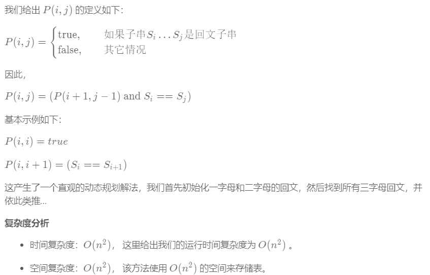

### 字符串

------

> https://leetcode-cn.com/tag/string/

&nbsp;

#### 1. 独特的电子邮件地址 #929 

- https://leetcode-cn.com/problems/unique-email-addresses/

- ```java
  public int numUniqueEmails(String[] emails) {
          HashSet<String> strings = new HashSet<>();
          for (String email : emails) {
              int plusPos = email.indexOf("+");
              int twoPos = email.indexOf("@");
              if(plusPos==-1)
                  plusPos = twoPos;
              String substring = email.substring(0, plusPos);
              String substring1 = email.substring(twoPos, email.length());
              strings.add(substring.replace(".", "") + substring1);
              
          }
          return strings.size();
      }
  ```

- Python:

  ```python
  def numUniqueEmails(self, emails):
          """
          :type emails: List[str]
          :rtype: int
          """
          res=set()
          for email in emails:
              local=email.split('@')[0]
              dns=email.split('@')[1]
              true_local=local.split('+')
              res.add(true_local[0].replace('.','')+dns)
          return len(res)
  ```

&nbsp;

#### 2. 唯一的莫尔斯密码词 #804

- https://leetcode-cn.com/problems/unique-morse-code-words/submissions/

- ```c++
  int uniqueMorseRepresentations(vector<string>& words) {
          vector<string> m = {".-","-...","-.-.","-..",".","..-.","--.","....","..",".---","-.-",".-..","--","-.","---",".--.","--.-",".-.","...","-","..-","...-",".--","-..-","-.--","--.."};        
          set<string> s;
          for(auto str: words){
              string ss = "";
              for(char c: str){
                  int index = c - 97;
                  ss = ss + m[index];
              }
              cout<<ss<<"\n";
              s.insert(ss);
          }
          
          return s.size();
      }
  ```

&nbsp;

#### 3. 无重复字符的最长子串 #3

- https://leetcode-cn.com/problems/longest-substring-without-repeating-characters/)

- 给定一个字符串，请你找出其中不含有重复字符的 **最长子串** 的长度。

- 思路1：暴力——超时

  ```c++
  int lengthOfLongestSubstring(string s) {
          int len = s.length();
          if(len==0)return 0;
          int res = 1;
          for(int i = 1 ;i <= len; i++){
              for(int j = 0; j < len; j++){
                  string str = s.substr(j, i);
                  map<char,int> m;
                  bool flag = false;
                  for(auto c: str){
                      if(m[c]>0){
                          flag = true;
                          break;
                      }
                      m[c]++;
                  }
                  if(flag==false){
                      int ll = str.length();
                      res = max(res, ll);
                  }
                      
              }
          }
          return res;
      }
  -------------------------------------------------------
  public int lengthOfLongestSubstring(String s) {
      int n = s.length();
      int ans = 0;
      for (int i = 0; i < n; i++)
          for (int j = i + 1; j <= n; j++)
              if (allUnique(s, i, j)) ans = Math.max(ans, j - i);
      return ans;
  }
  public boolean allUnique(String s, int start, int end) {
      Set<Character> set = new HashSet<>();
      for (int i = start; i < end; i++) {
          Character ch = s.charAt(i);
          if (set.contains(ch)) return false;
          set.add(ch);
      }
      return true;
  }
  ```

- 思路2：求无重复字符的最长子串的长度，从头到尾遍历字符串时（索引index），考虑到无重复字符，我们先把字符逐个放到容器set中，并更新最长子串的长度，如果遇到了重复字符，即当前遍历的字符在set中，则要从set中删除重复字符，包括这个重复字符前面的所有字符，也就是从当前子串的最左边（left）开始删除，直到删除重复字符

  ```c++
  int lengthOfLongestSubstring(string s) {
      set<char> cache;
      int maxlen = 0;
      int left = 0;
      int index = 0;
      while (index < s.size()) {
          if (cache.find(s[index]) == cache.end()) {
              cache.insert(s[index++]);  //有重复字符时，index还在原地
              maxlen = max(maxlen, (int)cache.size());
          }
          else {
              cache.erase(s[left++]);  //删除到当前的字符位置
          }
      }
      return maxlen;
  }
  ```

- 思路3：优化的窗口——使用map等结构

&nbsp;

#### ==4. 最长回文子串 #5==

- https://leetcode-cn.com/problems/longest-palindromic-substring/solution/

- 思路1：暴力——O(N^3^)

- 思路2：DP法。为了改进暴力法，我们首先观察如何避免在验证回文时进行不必要的重复计算。考虑 “ababa” 这个示例。如果我们已经知道 “bab” 是回文，那么很明显，“ababa” 一定是回文，因为它的左首字母和右尾字母是相同的。

  

  ```c++
  string longestPalindrome(string s) {
    	int n = s.length();
    	int longestBegin = 0;
    	int maxLen = 1;
    	bool table[1000][1000] = {false};
    	for (int i = 0; i < n; i++) {
      	table[i][i] = true;
    	}
    	for (int i = 0; i < n-1; i++) {
      	if (s[i] == s[i+1]) {
              table[i][i+1] = true;
              longestBegin = i;
              maxLen = 2;
      	}
    	}
    	for (int len = 3; len <= n; len++) {
      	for (int i = 0; i < n-len+1; i++) {
        		int j = i+len-1;
        		if (s[i] == s[j] && table[i+1][j-1]) {
                  table[i][j] = true;
                  longestBegin = i;
                  maxLen = len;
            	}
      	}
    	}
    	return s.substr(longestBegin, maxLen);
  }
  ```

&nbsp;

#### 5. Z字形变换 #6

- https://leetcode-cn.com/problems/zigzag-conversion/submissions/

- 思路：直接按行复制；

  ```c++
  string convert(string s, int numRows) {
      if(numRows == 1) return s;
      vector<string> rows(min(numRows, int(s.size())));
      int cur = 0;
      bool down = false;
      for(char c: s){
          rows[cur] += c;
          if(cur == 0 || cur == numRows - 1 )
              down = !down;
          cur += down ? 1 : -1;
      }
      string res;
      for(string row: rows)
          res += row;
      return res;
  }
  ```

&nbsp;

#### 6. 验证回文串 #125

- https://leetcode-cn.com/problems/valid-palindrome/

- 暴力：

  ```c++
  bool isPalindrome(string s) {
          int len = s.length();
          vector<char> tmp;
          for(int i = 0 ; i < len; i++){
              if((s[i]>='a' && s[i] <='z') || (s[i]>='A' && s[i] <='Z' ) || (s[i] >= '0' && s[i] <='9')){
                  if(s[i]>='a' && s[i] <='z'){
                      s[i] = s[i] - 32;
                      tmp.push_back(s[i]);
                  }
                  else tmp.push_back(s[i]);
              }
          }
          for(int i = 0 ; i<tmp.size();i++){
              cout<<tmp[i]<<" ";
          }
          int i = 0;
          int j = tmp.size() - 1;
          while(i<j){
              if(tmp[i]!=tmp[j]){
                  break;
              }
              i++;j--;
          }
          if(i<j)
              return false;
          else return true;
      }
  ```

&nbsp;

#### 7. 反转字符串2 #541

- https://leetcode-cn.com/problems/reverse-string-ii/submissions/

- 暴力：

  ```c++
  string reverseStr(string s, int k) {
          int len = s.length();
          if(len < k){
              for(int i = 0 , j = len-1; i<j;i++,j-- )
                  swap(s[i],s[j]);
              return s;
          }
          int fast = 2*k;
          int slow = 0;
          while(fast < len && slow < len){
              for(int i=slow,j=slow+k-1; i < j;i++,j--){
                  swap(s[i],s[j]);
              }
              slow = fast;
              fast = fast + 2*k;           
          }
          if(slow+k>len){
              for(int i = slow , j = len-1; i<j;i++,j-- )
                  swap(s[i],s[j]);
          }
          else {
              for(int i=slow,j=slow+k-1; i < j;i++,j--){
                  swap(s[i],s[j]);
              }
          }
          return s;
      }
  ```

&nbsp;

#### 8. 字符串转换整数 (atoi) #8

- https://leetcode-cn.com/problems/string-to-integer-atoi/

- 暴力：

  ```c++
  int myAtoi(string str) {
      for(int i = 0; i < str.length();i++){
          if(str[i] != ' '){
              str = str.substr(i);
              break;
          }
      }
      //cout<<str;
      int flag = 0;
      if(!((str[0]>='0' && str[0]<='9')||str[0]=='-'||str[0]=='+'))
          return 0;
      long res = 0;
      int i = 0;
      if(str[0] == '-'){
          i = 1;
          flag = 1;
      }
      else if(str[0] == '+'){
          i = 1;
      }
      for(; i < str.length();i++){
          if(str[i]>='0' && str[i]<='9'){
              res = res*10 + (str[i] - '0'); 
              if(res > 2147483647 && flag == 0)
                  return 2147483647;
              else if(res > 2147483648 && flag == 1)
                  return -2147483648;
          }else{
              break;
          }
      }
      res = flag ? -res:res;
      return res;
  }
  ```

&nbsp;

#### 9. 最长公共前缀 #14

- https://leetcode-cn.com/problems/longest-common-prefix/

- 暴力：

  ```c++
  string longestCommonPrefix(vector<string>& strs) {
      if (strs.empty() || strs[0].empty())
          return "";
      if (strs.size() == 1)
          return strs[0];
      string result = "";
      for (int i = 0; i < strs[0].length(); i++)
      {
          for (int j = 1; j < strs.size(); j++)
          {
              if (strs[0][i] != strs[j][i]) {
                  return result;
              }
          }
          result += strs[0][i];
      }
      return result;
  }
  ```

&nbsp;

#### 10. 旋转数字 #788

- https://leetcode-cn.com/problems/rotated-digits/

- ```c++
  int rotatedDigits(int N) {
      int res = 0;
      string s;
      for(int i = 1; i <= N; i++){
          s=to_string(i);
          bool flag=0;
          if((s.find('3')==-1 &&s.find('4')==-1 &&s.find('7')==-1))
          {
              for(int i=0;i<s.size();i++)
              {
                  //每次都将所有数字旋转，不是一个
                  if(s[i]=='2' || s[i]=='5' || s[i]=='6' || s[i]=='9')
                      flag=1;
              }
          }
          if(flag)
              res++;
      }
      return res;
  }
  ```

&nbsp;

#### 11. 报数 #38

- https://leetcode-cn.com/problems/count-and-say/submissions/

- 暴力：注意不等的时候，指针停留一次；

  ```c++
  string countAndSay(int n) {
          if(n==1)
              return "1";
          string s = "1";
          while(n>1){
              int index = 0;
              int cou = 0;
              string tmp = "";
              for(int i = 0 ; i < s.length(); i++){  
                  if(s[i]==s[index]){
                      //cout<<i<<" "<<s[i]<<"\n";
                      cou++;
                      if(i == s.length() - 1){
                           tmp += to_string(cou) + s[index];
                      }
                      
                  }
                  //cout<<cou<<" ";
                  else{
                      tmp += to_string(cou) + s[index];                    
                      index += cou;
                      //cout<<cou<<" "<<index<<"---\n";
                      cou = 0;
                      i--;
                  }                
              }
              s = tmp;
              cout<<s<<endl;
              n--;
          }
          return s;
      }
  ```

&nbsp;

#### 12. 学生出勤记录 I #551

- https://leetcode-cn.com/problems/student-attendance-record-i/

- 给定一个字符串来代表一个学生的出勤记录，这个记录仅包含以下三个字符：

  1. **'A'** : Absent，缺勤
  2. **'L'** : Late，迟到
  3. **'P'** : Present，到场

  如果一个学生的出勤记录中不**超过一个'A'(缺勤)**并且**不超过两个连续的'L'(迟到)**,那么这个学生会被奖赏。

  你需要根据这个学生的出勤记录判断他是否会被奖赏。

- 暴力：

  ```c++
  bool checkRecord(string s) {
      int couA = 0;
      int couL = 0;
      for(int i = 0; i < s.length(); i++){
          if(s[i] == 'A'){
              couA++;
          }
          else if(s[i] == 'L'){
              if(i-2>=0 && s[i-1] == 'L' && s[i-2] == 'L'){
                  couL = 1;
              }
          }
      }
      if(couA <= 1 && couL == 0)
          return true;
      return false;
  }
  ```

&nbsp;

#### 13. 反转字符串中的元音字母 #345

- https://leetcode-cn.com/problems/reverse-vowels-of-a-string/submissions/

- 暴力：

  ```c++
  string reverseVowels(string s) {
      int i = 0;
      int j = s.length() - 1;
      set<char> ss = {'a','e','i','o','u','A','E','I','O','U'};
      while(i < j){
          if(ss.count(s[i]) == 0)
              i++;
          else if(ss.count(s[j]) == 0)
              j--;
          else if(ss.count(s[i]) && ss.count(s[j])){
              swap(s[i],s[j]);
              i++;j--;
          }            
      }
      return s;
  }
  ```

&nbsp;

#### 14. 字符串中的第一个唯一字符 #387

- https://leetcode-cn.com/problems/first-unique-character-in-a-string/

- 暴力：默契的使用一个较大的值，来表示出现的次数；

  ```c++
  int firstUniqChar(string s) {
      unordered_map<char,int> hashmap; //可以保持插入顺序
      int count=s.length();
      for(int i=0;i<s.length();++i)
      {
          if(hashmap.count(s[i]))
          {
              ++count;
              hashmap[s[i]] = count;
          }
          else
              hashmap[s[i]] = i;
      }
  
      for(int i=0;i<s.length();++i)
      {
          if(hashmap.count(s[i]) && hashmap[s[i]]==i)
          {
              return i;
              break;
          }
  
      }
      return -1;
  }
  ```

&nbsp;

#### 15. 反转字符串中的单词 III #557

- https://leetcode-cn.com/problems/reverse-words-in-a-string-iii/

  ```c++
  string reverseWords(string s) {
      int left = 0;
      int right = 0;
      for(int i = 0; i < s.length(); i++){
          if(s[i] != ' '){
              right++;
              if(i == s.length() - 1){
                  cout<<left<<" "<<right<<" "<<s.length();
                  right--;
                  while(left<right){
                      swap(s[left],s[right]);
                      left++;
                      right--;
                  } 
              }
          }
          else{
              //反转
              right--;
              while(left<right){
                  swap(s[left],s[right]);
                  left++;
                  right--;
              }                
              left = i+1;
              right = i+1;
          }
      }
      return s;
  }
  ```

&nbsp;

#### 16. 山羊拉丁文 #824

- https://leetcode-cn.com/problems/goat-latin/

- ```c++
  string toGoatLatin(string S) {
          int len = S.length();
          vector<string> tmp;
          string str;
          for(int i = 0; i<len;i++){
              if(S[i]!=' '){
                  str += S[i];
                  if(i==len-1)
                      tmp.push_back(str);
              }
              else{
                  tmp.push_back(str);
                  str = "";
              }
          }
          str = "";
          for(int i = 0; i < tmp.size(); i++){
              if(isAeiou(tmp[i][0])){
                  tmp[i] += "ma";
              }else{
                  tmp[i] = tmp[i].substr(1) + tmp[i][0] + "ma";
              }
              int j = i+1;
              while(j--){
                  tmp[i] += 'a';
              }
              str += tmp[i] + " ";
          }
          if(str[str.length()-1] == ' ')
              str = str.substr(0, str.length()-1);
          return str;
      }
       bool isAeiou(char c) {
          return c == 'a' || c == 'e' || c == 'i' || c == 'o' || c == 'u' || c == 'A' || c == 'E' || c == 'I' || c == 'O' || c == 'U';
      }
  ```

&nbsp;

#### 17. 电话号码的字母组合 #17

- 

- ```c++
  vector<string> letterCombinations(string digits) {
          map<char,string> m;
          m['2'] = "abc";
          m['3'] = "def";
          m['4'] = "ghi";
          m['5'] = "jkl";
          m['6'] = "mno";
          m['7'] = "pqrs";
          m['8'] = "tuv";
          m['9'] = "wxyz";
          vector<string> ret;
          for(char c: m[digits[0]]){
              ret.push_back(string(1,c));       //return ret;
          }
          //cout<<"---"<<ret.size();
          for(int i = 1; i < digits.length();i++){
              string tmp = m[digits[i]];
              cout<<tmp<<endl;
              vector<string> v;
              for(auto s: ret){
                  for(auto k: tmp){
                      string sk = s + k;
                      v.push_back(sk);
                  }
              }
              ret = v;
          }        
          return ret;
      }
  ```

&nbsp;

#### 18. 实现strStr() #28

- https://leetcode-cn.com/problems/implement-strstr/

- 给定一个 haystack 字符串和一个 needle 字符串，在 haystack 字符串中找出 needle 字符串出现的第一个位置 (从0开始)。如果不存在，则返回  **-1**。

  ```c++
  int strStr(string haystack, string needle) {
      if(needle.size()==0)
          return 0;
      if(needle.size() > haystack.size())
          return -1;
      int j = 0;
      int i = 0;
      for(; i < haystack.size(); i++){
          if(j==needle.size()){
              return i - needle.size();
          }
          if(haystack[i]==needle[j])
              j++;
          else{
              i -= j; //回退指针
              j = 0;
          }
      }
      if(j==needle.size()){
              return i - needle.size();
      }
      return -1;
  }
  ```

&nbsp;

#### 19. 最后一个单词的长度 #58

- https://leetcode-cn.com/problems/length-of-last-word/

- 给定一个仅包含大小写字母和空格 `' '` 的字符串，返回其最后一个单词的长度。

  如果不存在最后一个单词，请返回 0 。**说明：**一个单词是指由字母组成，但不包含任何空格的字符串。

  ```c++
  int lengthOfLastWord(string s) {
      int res = 0;
      for(int i = 0 ; i < s.length(); i++){
          if(s[i] != ' '){
              res++;
              if(i==s.length()-1){
                  break;
              }
          }
          else{
              if(i==s.length()-1)
                  break;
              while(i<s.length() && s[i]==' ')
                  i++;
              if(i==s.length())
                  break; 
              else i--;
              res = 0;
          }
      }
      return res;
  }
  ```

&nbsp;

#### 20. 


