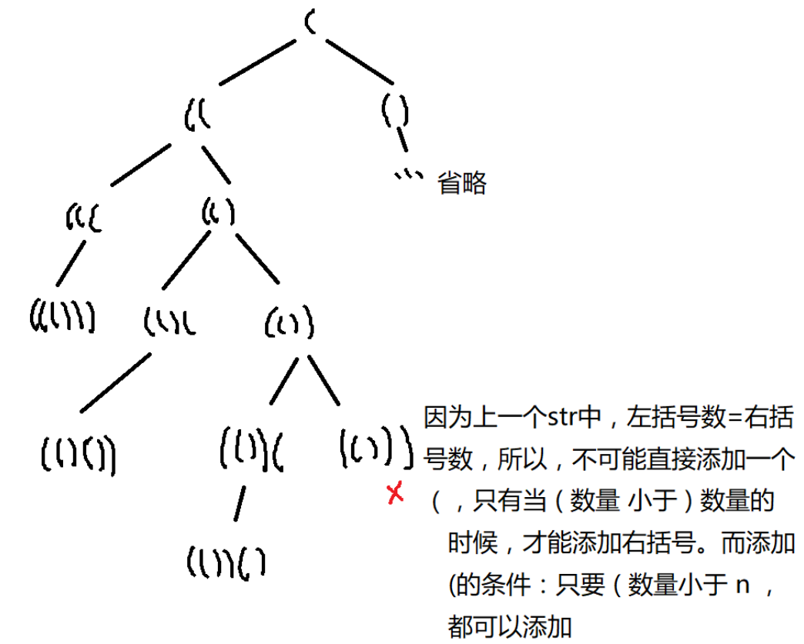
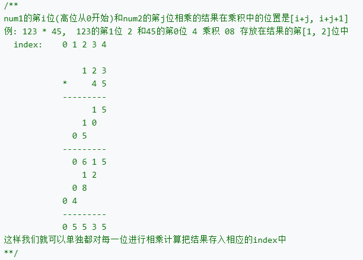

### 字符串

------

> https://leetcode-cn.com/tag/string/

&nbsp;

[TOC]


---

#### 1. 独特的电子邮件地址 #929 

- https://leetcode-cn.com/problems/unique-email-addresses/

- ```java
  public int numUniqueEmails(String[] emails) {
          HashSet<String> strings = new HashSet<>();
          for (String email : emails) {
              int plusPos = email.indexOf("+");
              int twoPos = email.indexOf("@");
              if(plusPos==-1)
                  plusPos = twoPos;
              String substring = email.substring(0, plusPos);
              String substring1 = email.substring(twoPos, email.length());
              strings.add(substring.replace(".", "") + substring1);
              
          }
          return strings.size();
      }
  ```

- Python:

  ```python
  def numUniqueEmails(self, emails):
          """
          :type emails: List[str]
          :rtype: int
          """
          res=set()
          for email in emails:
              local=email.split('@')[0]
              dns=email.split('@')[1]
              true_local=local.split('+')
              res.add(true_local[0].replace('.','')+dns)
          return len(res)
  ```

&nbsp;

#### 2. 唯一的莫尔斯密码词 #804

- https://leetcode-cn.com/problems/unique-morse-code-words/submissions/

- ```c++
  int uniqueMorseRepresentations(vector<string>& words) {
          vector<string> m = {".-","-...","-.-.","-..",".","..-.","--.","....","..",".---","-.-",".-..","--","-.","---",".--.","--.-",".-.","...","-","..-","...-",".--","-..-","-.--","--.."};        
          set<string> s;
          for(auto str: words){
              string ss = "";
              for(char c: str){
                  int index = c - 97;
                  ss = ss + m[index];
              }
              cout<<ss<<"\n";
              s.insert(ss);
          }
          
          return s.size();
      }
  ```

&nbsp;

#### 3. 无重复字符的最长子串 #3

- https://leetcode-cn.com/problems/longest-substring-without-repeating-characters/)

- 给定一个字符串，请你找出其中不含有重复字符的 **最长子串** 的长度。

- 思路1：暴力——超时

  ```c++
  int lengthOfLongestSubstring(string s) {
          int len = s.length();
          if(len==0)return 0;
          int res = 1;
          for(int i = 1 ;i <= len; i++){
              for(int j = 0; j < len; j++){
                  string str = s.substr(j, i);
                  map<char,int> m;
                  bool flag = false;
                  for(auto c: str){
                      if(m[c]>0){
                          flag = true;
                          break;
                      }
                      m[c]++;
                  }
                  if(flag==false){
                      int ll = str.length();
                      res = max(res, ll);
                  }
                      
              }
          }
          return res;
      }
  -------------------------------------------------------
  public int lengthOfLongestSubstring(String s) {
      int n = s.length();
      int ans = 0;
      for (int i = 0; i < n; i++)
          for (int j = i + 1; j <= n; j++)
              if (allUnique(s, i, j)) ans = Math.max(ans, j - i);
      return ans;
  }
  public boolean allUnique(String s, int start, int end) {
      Set<Character> set = new HashSet<>();
      for (int i = start; i < end; i++) {
          Character ch = s.charAt(i);
          if (set.contains(ch)) return false;
          set.add(ch);
      }
      return true;
  }
  ```

- 思路2：求无重复字符的最长子串的长度，从头到尾遍历字符串时（索引index），考虑到无重复字符，我们先把字符逐个放到容器set中，并更新最长子串的长度，如果遇到了重复字符，即当前遍历的字符在set中，则要从set中删除重复字符，包括这个重复字符前面的所有字符，也就是从当前子串的最左边（left）开始删除，直到删除重复字符

  ```c++
  int lengthOfLongestSubstring(string s) {
      set<char> cache;
      int maxlen = 0;
      int left = 0;
      int index = 0;
      while (index < s.size()) {
          if (cache.find(s[index]) == cache.end()) {
              cache.insert(s[index++]);  //有重复字符时，index还在原地
              maxlen = max(maxlen, (int)cache.size());
          }
          else {
              cache.erase(s[left++]);  //删除到当前的字符位置
          }
      }
      return maxlen;
  }
  ```

- 思路3：优化的窗口——使用map等结构

&nbsp;

#### ==4. 最长回文子串 #5==

- https://leetcode-cn.com/problems/longest-palindromic-substring/solution/

- 思路1：暴力——O(N^3^)

- 思路2：DP法。为了改进暴力法，我们首先观察如何避免在验证回文时进行不必要的重复计算。考虑 “ababa” 这个示例。如果我们已经知道 “bab” 是回文，那么很明显，“ababa” 一定是回文，因为它的左首字母和右尾字母是相同的。

  

  ```c++
  string longestPalindrome(string s) {
    	int n = s.length();
    	int longestBegin = 0;
    	int maxLen = 1;
    	bool table[1000][1000] = {false};
    	for (int i = 0; i < n; i++) {
      	table[i][i] = true;
    	}
    	for (int i = 0; i < n-1; i++) {
      	if (s[i] == s[i+1]) {
              table[i][i+1] = true;
              longestBegin = i;
              maxLen = 2;
      	}
    	}
    	for (int len = 3; len <= n; len++) {
      	for (int i = 0; i < n-len+1; i++) {
        		int j = i+len-1;
        		if (s[i] == s[j] && table[i+1][j-1]) {
                  table[i][j] = true;
                  longestBegin = i;
                  maxLen = len;
            	}
      	}
    	}
    	return s.substr(longestBegin, maxLen);
  }
  ```

&nbsp;

#### 5. Z字形变换 #6

- https://leetcode-cn.com/problems/zigzag-conversion/submissions/

- 思路：直接按行复制；

  ```c++
  string convert(string s, int numRows) {
      if(numRows == 1) return s;
      vector<string> rows(min(numRows, int(s.size())));
      int cur = 0;
      bool down = false;
      for(char c: s){
          rows[cur] += c;
          if(cur == 0 || cur == numRows - 1 )
              down = !down;
          cur += down ? 1 : -1;
      }
      string res;
      for(string row: rows)
          res += row;
      return res;
  }
  ```

&nbsp;

#### 6. 验证回文串 #125

- https://leetcode-cn.com/problems/valid-palindrome/

- 暴力：

  ```c++
  bool isPalindrome(string s) {
          int len = s.length();
          vector<char> tmp;
          for(int i = 0 ; i < len; i++){
              if((s[i]>='a' && s[i] <='z') || (s[i]>='A' && s[i] <='Z' ) || (s[i] >= '0' && s[i] <='9')){
                  if(s[i]>='a' && s[i] <='z'){
                      s[i] = s[i] - 32;
                      tmp.push_back(s[i]);
                  }
                  else tmp.push_back(s[i]);
              }
          }
          for(int i = 0 ; i<tmp.size();i++){
              cout<<tmp[i]<<" ";
          }
          int i = 0;
          int j = tmp.size() - 1;
          while(i<j){
              if(tmp[i]!=tmp[j]){
                  break;
              }
              i++;j--;
          }
          if(i<j)
              return false;
          else return true;
      }
  ```

&nbsp;

#### 7. 反转字符串2 #541

- https://leetcode-cn.com/problems/reverse-string-ii/submissions/

- 暴力：

  ```c++
  string reverseStr(string s, int k) {
          int len = s.length();
          if(len < k){
              for(int i = 0 , j = len-1; i<j;i++,j-- )
                  swap(s[i],s[j]);
              return s;
          }
          int fast = 2*k;
          int slow = 0;
          while(fast < len && slow < len){
              for(int i=slow,j=slow+k-1; i < j;i++,j--){
                  swap(s[i],s[j]);
              }
              slow = fast;
              fast = fast + 2*k;           
          }
          if(slow+k>len){
              for(int i = slow , j = len-1; i<j;i++,j-- )
                  swap(s[i],s[j]);
          }
          else {
              for(int i=slow,j=slow+k-1; i < j;i++,j--){
                  swap(s[i],s[j]);
              }
          }
          return s;
      }
  ```

&nbsp;

#### 8. 字符串转换整数 (atoi) #8

- https://leetcode-cn.com/problems/string-to-integer-atoi/

- 暴力：

  ```c++
  int myAtoi(string str) {
      for(int i = 0; i < str.length();i++){
          if(str[i] != ' '){
              str = str.substr(i);
              break;
          }
      }
      //cout<<str;
      int flag = 0;
      if(!((str[0]>='0' && str[0]<='9')||str[0]=='-'||str[0]=='+'))
          return 0;
      long res = 0;
      int i = 0;
      if(str[0] == '-'){
          i = 1;
          flag = 1;
      }
      else if(str[0] == '+'){
          i = 1;
      }
      for(; i < str.length();i++){
          if(str[i]>='0' && str[i]<='9'){
              res = res*10 + (str[i] - '0'); 
              if(res > 2147483647 && flag == 0)
                  return 2147483647;
              else if(res > 2147483648 && flag == 1)
                  return -2147483648;
          }else{
              break;
          }
      }
      res = flag ? -res:res;
      return res;
  }
  ```

&nbsp;

#### 9. 最长公共前缀 #14

- https://leetcode-cn.com/problems/longest-common-prefix/

- 暴力：

  ```c++
  string longestCommonPrefix(vector<string>& strs) {
      if (strs.empty() || strs[0].empty())
          return "";
      if (strs.size() == 1)
          return strs[0];
      string result = "";
      for (int i = 0; i < strs[0].length(); i++)
      {
          for (int j = 1; j < strs.size(); j++)
          {
              if (strs[0][i] != strs[j][i]) {
                  return result;
              }
          }
          result += strs[0][i];
      }
      return result;
  }
  ```

&nbsp;

#### 10. 旋转数字 #788

- https://leetcode-cn.com/problems/rotated-digits/

- ```c++
  int rotatedDigits(int N) {
      int res = 0;
      string s;
      for(int i = 1; i <= N; i++){
          s=to_string(i);
          bool flag=0;
          if((s.find('3')==-1 &&s.find('4')==-1 &&s.find('7')==-1))
          {
              for(int i=0;i<s.size();i++)
              {
                  //每次都将所有数字旋转，不是一个
                  if(s[i]=='2' || s[i]=='5' || s[i]=='6' || s[i]=='9')
                      flag=1;
              }
          }
          if(flag)
              res++;
      }
      return res;
  }
  ```

&nbsp;

#### 11. 报数 #38

- https://leetcode-cn.com/problems/count-and-say/submissions/

- 暴力：注意不等的时候，指针停留一次；

  ```c++
  string countAndSay(int n) {
          if(n==1)
              return "1";
          string s = "1";
          while(n>1){
              int index = 0;
              int cou = 0;
              string tmp = "";
              for(int i = 0 ; i < s.length(); i++){  
                  if(s[i]==s[index]){
                      //cout<<i<<" "<<s[i]<<"\n";
                      cou++;
                      if(i == s.length() - 1){
                           tmp += to_string(cou) + s[index];
                      }
                      
                  }
                  //cout<<cou<<" ";
                  else{
                      tmp += to_string(cou) + s[index];                    
                      index += cou;
                      //cout<<cou<<" "<<index<<"---\n";
                      cou = 0;
                      i--;
                  }                
              }
              s = tmp;
              cout<<s<<endl;
              n--;
          }
          return s;
      }
  ```

&nbsp;

#### 12. 学生出勤记录 I #551

- https://leetcode-cn.com/problems/student-attendance-record-i/

- 给定一个字符串来代表一个学生的出勤记录，这个记录仅包含以下三个字符：

  1. **'A'** : Absent，缺勤
  2. **'L'** : Late，迟到
  3. **'P'** : Present，到场

  如果一个学生的出勤记录中不**超过一个'A'(缺勤)**并且**不超过两个连续的'L'(迟到)**,那么这个学生会被奖赏。

  你需要根据这个学生的出勤记录判断他是否会被奖赏。

- 暴力：

  ```c++
  bool checkRecord(string s) {
      int couA = 0;
      int couL = 0;
      for(int i = 0; i < s.length(); i++){
          if(s[i] == 'A'){
              couA++;
          }
          else if(s[i] == 'L'){
              if(i-2>=0 && s[i-1] == 'L' && s[i-2] == 'L'){
                  couL = 1;
              }
          }
      }
      if(couA <= 1 && couL == 0)
          return true;
      return false;
  }
  ```

&nbsp;

#### 13. 反转字符串中的元音字母 #345

- https://leetcode-cn.com/problems/reverse-vowels-of-a-string/submissions/

- 暴力：

  ```c++
  string reverseVowels(string s) {
      int i = 0;
      int j = s.length() - 1;
      set<char> ss = {'a','e','i','o','u','A','E','I','O','U'};
      while(i < j){
          if(ss.count(s[i]) == 0)
              i++;
          else if(ss.count(s[j]) == 0)
              j--;
          else if(ss.count(s[i]) && ss.count(s[j])){
              swap(s[i],s[j]);
              i++;j--;
          }            
      }
      return s;
  }
  ```

&nbsp;

#### 14. 字符串中的第一个唯一字符 #387

- https://leetcode-cn.com/problems/first-unique-character-in-a-string/

- 暴力：默契的使用一个较大的值，来表示出现的次数；

  ```c++
  int firstUniqChar(string s) {
      unordered_map<char,int> hashmap; //可以保持插入顺序
      int count=s.length();
      for(int i=0;i<s.length();++i)
      {
          if(hashmap.count(s[i]))
          {
              ++count;
              hashmap[s[i]] = count;
          }
          else
              hashmap[s[i]] = i;
      }
  
      for(int i=0;i<s.length();++i)
      {
          if(hashmap.count(s[i]) && hashmap[s[i]]==i)
          {
              return i;
              break;
          }
  
      }
      return -1;
  }
  ```

&nbsp;

#### 15. 反转字符串中的单词 III #557

- https://leetcode-cn.com/problems/reverse-words-in-a-string-iii/

  ```c++
  string reverseWords(string s) {
      int left = 0;
      int right = 0;
      for(int i = 0; i < s.length(); i++){
          if(s[i] != ' '){
              right++;
              if(i == s.length() - 1){
                  cout<<left<<" "<<right<<" "<<s.length();
                  right--;
                  while(left<right){
                      swap(s[left],s[right]);
                      left++;
                      right--;
                  } 
              }
          }
          else{
              //反转
              right--;
              while(left<right){
                  swap(s[left],s[right]);
                  left++;
                  right--;
              }                
              left = i+1;
              right = i+1;
          }
      }
      return s;
  }
  ```

&nbsp;

#### 16. 山羊拉丁文 #824

- https://leetcode-cn.com/problems/goat-latin/

- ```c++
  string toGoatLatin(string S) {
          int len = S.length();
          vector<string> tmp;
          string str;
          for(int i = 0; i<len;i++){
              if(S[i]!=' '){
                  str += S[i];
                  if(i==len-1)
                      tmp.push_back(str);
              }
              else{
                  tmp.push_back(str);
                  str = "";
              }
          }
          str = "";
          for(int i = 0; i < tmp.size(); i++){
              if(isAeiou(tmp[i][0])){
                  tmp[i] += "ma";
              }else{
                  tmp[i] = tmp[i].substr(1) + tmp[i][0] + "ma";
              }
              int j = i+1;
              while(j--){
                  tmp[i] += 'a';
              }
              str += tmp[i] + " ";
          }
          if(str[str.length()-1] == ' ')
              str = str.substr(0, str.length()-1);
          return str;
      }
       bool isAeiou(char c) {
          return c == 'a' || c == 'e' || c == 'i' || c == 'o' || c == 'u' || c == 'A' || c == 'E' || c == 'I' || c == 'O' || c == 'U';
      }
  ```

&nbsp;

#### 17. 电话号码的字母组合 #17

- 

- ```c++
  vector<string> letterCombinations(string digits) {
          map<char,string> m;
          m['2'] = "abc";
          m['3'] = "def";
          m['4'] = "ghi";
          m['5'] = "jkl";
          m['6'] = "mno";
          m['7'] = "pqrs";
          m['8'] = "tuv";
          m['9'] = "wxyz";
          vector<string> ret;
          for(char c: m[digits[0]]){
              ret.push_back(string(1,c));       //return ret;
          }
          //cout<<"---"<<ret.size();
          for(int i = 1; i < digits.length();i++){
              string tmp = m[digits[i]];
              cout<<tmp<<endl;
              vector<string> v;
              for(auto s: ret){
                  for(auto k: tmp){
                      string sk = s + k;
                      v.push_back(sk);
                  }
              }
              ret = v;
          }        
          return ret;
      }
  ```

&nbsp;

#### 18. 实现strStr() #28

- https://leetcode-cn.com/problems/implement-strstr/

- 给定一个 haystack 字符串和一个 needle 字符串，在 haystack 字符串中找出 needle 字符串出现的第一个位置 (从0开始)。如果不存在，则返回  **-1**。

  ```c++
  int strStr(string haystack, string needle) {
      if(needle.size()==0)
          return 0;
      if(needle.size() > haystack.size())
          return -1;
      int j = 0;
      int i = 0;
      for(; i < haystack.size(); i++){
          if(j==needle.size()){
              return i - needle.size();
          }
          if(haystack[i]==needle[j])
              j++;
          else{
              i -= j; //回退指针
              j = 0;
          }
      }
      if(j==needle.size()){
              return i - needle.size();
      }
      return -1;
  }
  ```

&nbsp;

#### 19. 最后一个单词的长度 #58

- https://leetcode-cn.com/problems/length-of-last-word/

- 给定一个仅包含大小写字母和空格 `' '` 的字符串，返回其最后一个单词的长度。

  如果不存在最后一个单词，请返回 0 。**说明：**一个单词是指由字母组成，但不包含任何空格的字符串。

  ```c++
  int lengthOfLastWord(string s) {
      int res = 0;
      for(int i = 0 ; i < s.length(); i++){
          if(s[i] != ' '){
              res++;
              if(i==s.length()-1){
                  break;
              }
          }
          else{
              if(i==s.length()-1)
                  break;
              while(i<s.length() && s[i]==' ')
                  i++;
              if(i==s.length())
                  break; 
              else i--;
              res = 0;
          }
      }
      return res;
  }
  ```

&nbsp;

#### ==20. 括号生成 #22==

- https://leetcode-cn.com/problems/generate-parentheses/

- 给出 *n* 代表生成括号的对数，请你写出一个函数，使其能够生成所有可能的并且**有效的**括号组合。

  例如，给出 *n* = 3，生成结果为：

  ```properties
  [
    "((()))",
    "(()())",
    "(())()",
    "()(())",
    "()()()"
  ]
  ```

- 思路：暴力？将会产生2^2n^个排列，再判断？这里可以使用递归来生产括号的序列，n长的序列，包含‘(’和‘)’加上n-1的序列。生成出一个序列后，对序列进行判断时，能够发现**规律**：序列的平衡性——按序遍历时，balance表示（左括号-又括号）的净值，一旦其值小于0，或者结果不为0，表示该序列不能配对。

  ```java
  public List<String> generateParenthesis(int n) {
      List<String> combinations = new ArrayList();
      generateAll(new char[2 * n], 0, combinations);
      return combinations;
  }
  
  public void generateAll(char[] current, int pos, List<String> result) {
      if (pos == current.length) {
          if (valid(current))
              result.add(new String(current));
      } else {
          current[pos] = '(';
          generateAll(current, pos+1, result);
          current[pos] = ')';
          generateAll(current, pos+1, result);
      }
  }
  
  public boolean valid(char[] current) {
      int balance = 0;
      for (char c: current) {
          if (c == '(') balance++;
          else balance--;
          if (balance < 0) return false;
      }
      return (balance == 0);
  }
  ```

  ```c++
  vector<string> generateParenthesis(int n) {
      vector<string> ret;
      char tmp[2*n+1];
      GenerateSq(tmp, 0, ret, 2*n);
      return ret;
  }
  void GenerateSq(char tmp[], int pos, vector<string> &ret, int length){
      if(pos == length){
          if(valid(tmp, length))
              ret.push_back(tmp);
      }
      else{
          tmp[pos] = '(';
          GenerateSq(tmp, pos+1, ret, length);
          tmp[pos] = ')';
          GenerateSq(tmp, pos+1, ret, length);
      }
  }
  bool valid(char tmp[], int length){
      int balance = 0;
      for(int i = 0; i < length; i++){
          if(tmp[i]=='(')
              balance++;
          else balance--;
          if(balance<0)
              return false;
      }
      return (balance==0);
  }
  ```

- 思路2：回溯法。回溯算法实际上一个类似枚举的搜索尝试过程，主要是在搜索尝试过程中寻找问题的解，当发现已不满足求解条件时，就“回溯”返回，尝试别的路径。回溯法是一种选优搜索法，按选优条件向前搜索，以达到目标。但当探索到某一步时，发现原先选择并不优或达不到目标，就退回一步重新选择，这种走不通就退回再走的技术为回溯法，而满足回溯条件的某个状态的点称为“回溯点”。

  

  > 回溯算法和递归算法的区别：回溯算法指的是一种思想，而递归算法则是指代码层面上的一种组织结构。

  ```c++
  vector<string> generateParenthesis(int n) {
      vector<string> res;
      Backtrack("",res,n,0,0);
      return res;
  }
  void Backtrack(string cur, vector<string> &res, int n, int left, int right)
  {
      //因为right是右括号，数量=n 表明此时已经找到一个结果
      if (right == n){
          res.push_back(cur);
      }
      //可以添加一个左括号
      if (left < n){
          Backtrack(cur+'(',res,n,left+1,right);
      }
      //添加一个右括号
      if (right < left){
          Backtrack(cur+')',res,n,left,right+1);
      }
  }
  ```

  &nbsp;

#### 21. 字符串相乘

- https://leetcode-cn.com/problems/multiply-strings/

- 给定两个以字符串形式表示的非负整数 `num1` 和 `num2`，返回 `num1` 和 `num2` 的乘积，它们的乘积也表示为字符串形式。不用大数等类库。

- 思路：1. 长度为n,m的两个数的乘积的长度不会超过n+m的。可以直接模拟数的乘法：我们从最低位开始，一个数的i位和另一个数的j位相乘的结果，放在i+j和i+j+1两个位置上。

  

  ```java
  public static String multiply(String num1, String num2) {
      char[] ret = new char[num1.length() + num2.length()];
      for(int i = num1.length() - 1; i >= 0; i--){
          for(int j = num2.length() - 1; j >= 0; j--){
              ret[i+j+1] += (num1.charAt(i) - '0') * (num2.charAt(j) - '0');
          }
      }
      int carry = 0;
      for(int i = ret.length-1; i >= 0; i--){   //char类型会自动转成int进行计算
          ret[i] += carry;
          carry = ret[i] / 10;
          ret[i] = (char) (ret[i] % 10);
      }
      int index = 0;
      while(ret[index]==0 && index < ret.length - 1){  //char默认初始值为空，与0相等的,与' '字符不等
          index++;
      }
      for(int i = index;i<ret.length;i++){
          ret[i] += '0';   //把数组结果转成一个字符结果，如3-》'3';
      }		
      return new String(ret, index, ret.length - index);
  }
  ```

  ```java
  public static String multiply2(String num1, String num2) {
      int[] ret = new int[num1.length() + num2.length()];
      for(int i = num1.length() - 1; i >= 0; i--){
          for(int j = num2.length() - 1; j >= 0; j--){
          	 //直接处理每次的进位
              int tmp = (num1.charAt(i) - '0') * (num2.charAt(j) - '0'); 
              tmp += ret[i+j+1];
              ret[i+j] += tmp / 10;   //记得累加
              ret[i+j+1] = tmp % 10;				
          }
      }
      //去前缀0
      int index = 0;
      while(index < ret.length - 1 && ret[index] == 0)   
          index++;    //ret.length - 1是因为要保留最后一个0
      StringBuilder sb = new StringBuilder();
      for(;index<ret.length;index++){
          sb.append(ret[index]);
      }
      return sb.toString();
  }
  ```

  ```c++
  string multiply(string num1, string num2) {
      int ret[num1.length() + num2.length()] = {0};
      int tmp = 0;
      for(int i = num1.length()-1; i >= 0;  i--){
          for(int j = num2.length()-1; j >= 0; j--){
              tmp = (num1[i]-'0') * (num2[j]-'0');
              tmp += ret[i+j+1];
              ret[i+j] += tmp / 10;  //此处记得累加前一位的值，有i+j=j+i的时候
              ret[i+j+1] = tmp % 10;  //这个就是剩余的余数了
          }
      }
      int index = 0;
      while(index<(num1.length() + num2.length() - 1) && ret[index] == 0)
          index++;
      string res;
      for(int i = index; i < num1.length() + num2.length(); i++){
          res += to_string(ret[i]);
      }
      return res;
  }
  ```

  &nbsp;

#### 22. 二进制求和 #67

- https://leetcode-cn.com/problems/add-binary/

- 给定两个二进制字符串，返回他们的和（用二进制表示）。

  输入为**非空**字符串且只包含数字 `1` 和 `0`。

  **示例 1:**

  ```properties
  输入: a = "11", b = "1"
  输出: "100"
  输入: a = "1010", b = "1011"
  输出: "10101"
  ```

- 思路：了解到高位可以用0补齐，这样可以在一个循环体中完成。

  ```c++
  string addBinary(string a, string b) {
      string result; 
      int carry=0, i,j;
      for(i = a.size()-1 , j = b.size()-1; j>=0 || i>=0 ; j--,i--){
          int i1 = i>=0?a[i]-'0':0;
          int j1 = j>=0?b[j]-'0':0;   //高位补齐0
          int temp = i1 + j1 + carry ;
          if(temp > 1) 
              carry=1;    //进位
          else
              carry=0;
          if(temp == 2 || temp == 0)
              result.insert(result.begin(),'0');
          else
              result.insert(result.begin(),'1');
      }
      if(carry == 1)
          result.insert(result.begin(),'1');
      return result;
  }
  ```

  &nbsp;

#### 23. 字母异位词分组 #49

- https://leetcode-cn.com/problems/group-anagrams/

- 给定一个字符串数组，将字母异位词组合在一起。字母异位词指字母相同，但排列不同的字符串。

  **示例:**

  ```properties
  输入: ["eat", "tea", "tan", "ate", "nat", "bat"],
  输出:
  [
    ["ate","eat","tea"],
    ["nat","tan"],
    ["bat"]
  ]
  ```

- 思路：使用一个map来辅助记录某一个分组。

  ```c++
  vector<vector<string>> groupAnagrams(vector<string>& strs) {
          vector<vector<string>> ret;
          map<string, int> m;
          for(int i = 0, index = 0; i < strs.size(); i++){
              string str = strs[i];
              sort(str.begin(), str.end());
              if(m.count(str)==0){
                  m[str] = index;
                  ret.push_back(vector<string>{strs[i]});  //注意空指针
                  index++;
              }else{
                  ret[m[str]].push_back(strs[i]);
              }
          }
          return ret;
      }
  ```

&nbsp;

#### ==24. 复原IP地址 #93==

- https://leetcode-cn.com/problems/restore-ip-addresses/

- 给定一个只包含数字的字符串，复原它并返回所有可能的 IP 地址格式。

  **示例:**

  ```properties
  输入: "25525511135"
  输出: ["255.255.11.135", "255.255.111.35"]
  ```

- 思路1：暴力，每次获取不超过3位，用三个循环来完成

  ```java
  class Solution {
      public List<String> restoreIpAddresses(String s) {
          List<String> res = new ArrayList<>();
          if (s == null || s.length() == 0 || s.length() > 12) {
              return res;
          }
          for (int i = 1; i <= 3 && i < s.length(); i++) {
              String p1 = s.substring(0, i);
              if (isLegal(p1)) {
                  for (int j = i + 1; j <= 6 && j < s.length(); j++) {
                      String p2 = s.substring(i, j);
                      if (isLegal(p2)) {
                          for (int k = j + 1; k <= 9 && k < s.length(); k++) {
                              String p3 = s.substring(j, k);
                              if (isLegal(p3)) {
                                  String p4 = s.substring(k);
                                  if (isLegal(p4)) {
                                      res.add(p1 + "." + p2 + "." + p3 + "." + p4);
                                  }
                              }
                          }
                      }
                  }
              }
          }
          return res;
      }
  
      public boolean isLegal(String p) {
          if (p.startsWith("0")) {
              return "0".equals(p);
          } else {
              return Integer.valueOf(p) <= 255;
          }
      }
  }
  ```

- 思路2：回溯+递归。取一个候选子串，判断是否合理；接着index往下递归；

  ```c++
  vector<string> restoreIpAddresses(string s) {
      vector<string> ret;
      if(s.empty() || s.length() < 4 || s.length() > 12)
          return {};
      BKTrace(ret, s, "", 0, 0);
      return ret;
  }
  void BKTrace(vector<string> &ret, string s, string tmp, int parts, int index){
      if(parts > 4)
          return;
      if(parts == 4 && index == s.length()){
          ret.push_back(tmp);
          return;
      }
      for(int i = 1; i+index <= s.length() && i <= 3; i++){
          if(s.at(index) == '0'){ //前缀0的处理
              BKTrace(ret, s, tmp + (parts == 3 ? "0" : "0."), parts+1, index+1);
              return;  //此处必须return，否则会继续处理
          }
          string sub = s.substr(index, i);
          if(stoi(sub) > 255)
              return;
          BKTrace(ret, s, tmp + sub + (parts == 3 ? "" : "."), parts+1, index+i);
      } 
  }
  ```

#### 25. 翻转字符串里的单词 #151

- https://leetcode-cn.com/problems/reverse-words-in-a-string/submissions/

- 给定一个字符串，逐个翻转字符串中的每个单词。 

  **示例 1：**

  ```properties
  输入: "the sky is blue"
  输出: "blue is sky the"
  ```

- 代码

  ```c++
  string reverseWords(string s) {
          int right = s.length() - 1;
          string ret = "";
          int left = right;
          if(s.empty())
              return ret;
          while(right>=0 && left >=0){
              while(right >= 0 && s[right] == ' '){
                  right--;
                  left--;
              }
              while(left >= 0 && s[left] != ' '){
                  left--;
              }
              string tmp = s.substr(left+1, right-left);
              ret += tmp;
              if(left>0)
                  ret += " ";
              right = left;
          }
          if(ret[ret.length()-1]==' ')
              ret = ret.substr(0, ret.length()-1);
          return ret;
      }
  ```

&nbsp;

####  26. 压缩字符串 #443

- https://leetcode-cn.com/problems/string-compression/

- 给定一组字符，使用原地算法将其压缩。压缩后的长度必须始终小于或等于原数组长度。数组的每个元素应该是长度为1 的**字符**（不是 int 整数类型）。在完成原地**修改输入数组**后，返回数组的新长度。

- **示例 1：**

  ```properties
  输入：
  ["a","a","b","b","c","c","c"]
  输出：
  返回6，输入数组的前6个字符应该是：["a","2","b","2","c","3"]
  ```

- 思路：双指针法。

  ```c++
  int compress(vector<char>& chars) {
          int len = chars.size() ;
          if(chars.empty()) return 0;
          int left = 0, right = 0;
          int index = 0;
          while(right<len){
              while(right < len && chars[right]==chars[left])
                  right++;
              if(right-left==1){
                  chars[index++] = chars[left];
                  left++;
              }
              else{
                  chars[index++] = chars[left];
                  int cnt = right - left;
                  int n = 10;
                  while(n<=cnt)
                      n = n * 10;
                  n /= 10;
                  while(n>0){
                      chars[index++] = cnt / n + '0';
                      cnt  %= n;
                      n /= 10;
                  }
                  left = right;
              }
          }
          return index;
      }
  ```


